# Reverse Engineering Report IV.1.2 Pipeline Pemrosesan Log dan Deteksi Anomali

> **Laporan ini dibuat secara otomatis dari inspeksi source code repository.**
> Tidak ada klaim evaluasi atau hasil eksperimen yang tidak didukung oleh source code.
> Semua baris kode yang dirujuk mengacu pada file aktual di repository ini.

---

## 1. Ringkasan Temuan

Pipeline pemrosesan log dan deteksi anomali pada sistem ini terdiri dari empat komponen utama yang bekerja secara berurutan:

1. **Log Upload & Storage** — File log diterima via HTTP API, divalidasi, dan disimpan dalam direktori sesi unik.
2. **Profil Parsing & Normalisasi** — Sistem mendeteksi tipe log secara otomatis (EVTX Sysmon, Windows LogHub CBS, Linux AIT-LDS, atau general) dan memilih profile parser yang sesuai. Parsing dilakukan oleh `DrainParser` menggunakan library `drain3` atau modul training khusus.
3. **Template Mining & Deteksi Anomali DeepLog** — Setiap baris log dikonversi menjadi event template. Sequence template dibentuk dalam sliding window dan diinput ke model LSTM `DeepLogDetector`. Model menentukan apakah event berikutnya anomali berdasarkan top-k prediction.
4. **LLM Anomaly Filter** — `LLMAnomalyFilter` melakukan satu *batch-level sanity gate* menggunakan LLM (Ollama/Gemini/OpenRouter). Output berupa keputusan *policy* yang menentukan subset anomali yang diteruskan ke AI Agent.
5. **AI Agent Investigation** — `DFIRAgent` menerima anomali yang telah difilter, mengekstrak IOC, dan menghasilkan laporan investigasi terstruktur.

**Komponen yang ditemukan di source code:** upload router, storage service, `parse_with_profile`, `DrainParser`, `_extract_parameters`, `parse_log_file`, `DeepLogDetector`, `detect_anomalies_in_logs`, `LLMAnomalyFilter`, `append_gate_observations`, `run_investigation_pipeline`, `DFIRAgent`, `ReportGenerator`.

**Komponen yang tidak ditemukan atau tidak dapat dipastikan:**
- File bobot model DeepLog (`.pt`) dikonfigurasi via path absolut eksternal di luar repository (lihat `config.py`).
- Tidak ada direktori `models/` dalam repository ini yang menyimpan file model.
- Hasil evaluasi precision/recall/F1 tidak ditemukan dalam source code.
- Konfigurasi Drain `.ini` (`drain_config.ini`) dikonfigurasi sebagai path relative tetapi file aktualnya tidak ditemukan di repository.

---

## 2. File dan Modul Terkait

| Komponen | Path File | Jenis | Input | Output | Peran dalam Pipeline | Catatan Implementasi |
|---|---|---|---|---|---|---|
| `upload_log_file` | `backend/routers/upload.py:L15-L44` | router | `UploadFile` (multipart) | `session_id`, `file_name`, `file_size` | Entry point upload log | Memanggil `store_uploaded_file` dari storage service |
| `store_uploaded_file` | `backend/services/storage_service.py:L86-L103` | service | `UploadFile`, prefix string | `session_id`, safe_file_name, `file_path`, `file_size` | Validasi ekstensi, sanitasi nama file, simpan ke disk | Ekstensi yang diizinkan: `.evtx`, `.log`, `.txt`, `.csv`; max upload: 250 MB |
| `run_investigation_pipeline` | `backend/services/orchestrator_service.py:L134-L596` | service | `session_id` | Mengedit `session_store`; memanggil report generator | Orkestrator pipeline utama (background task) | Dijalankan sebagai FastAPI `BackgroundTask`; 4 stage: parsing → anomaly → LLM gate → AI agent |
| `parse_with_profile` | `backend/services/parsing_service.py:L194-L274` | function | `file_path`, `settings`, `max_lines` | `parsed_df`, `templates`, `selected_profile` | Auto-detect profile parser; memanggil `parse_log_file` | Deteksi urutan: windows_loghub → linux_ait_lds → sysmon (post-parse) → windows_apt → general |
| `build_model_profile` | `backend/services/parsing_service.py:L24-L95` | function | `name`, `settings` | `dict` profile dengan `model_path`, `vocab_path`, `window_size`, `topk`, `template_strategy` | Membangun konfigurasi profile model | Profile yang didukung: sysmon, windows_loghub, windows_apt, lmd_enriched, linux_ait_lds, general |
| `DrainParser` | `backend/modules/parsing.py:L53-L721` | class | Bergantung pada method yang dipanggil | `pd.DataFrame` dengan kolom terstruktur | Parsing file log dengan algoritma Drain | Mendukung EVTX, CSV, dan teks biasa; menggunakan `drain3.TemplateMiner` |
| `DrainParser.parse_file` | `backend/modules/parsing.py:L358-L367` | function | `file_path`, `max_lines` | `pd.DataFrame` | Auto-detect file type (.evtx, .csv, atau text) | Dispatcher ke `parse_evtx_file`, `parse_csv_log`, atau `parse_text_log` |
| `DrainParser.parse_evtx_file` | `backend/modules/parsing.py:L100-L210` | function | `file_path`, `max_lines` | `pd.DataFrame` | Parsing EVTX, ekstraksi System fields dan EventData | Menggunakan library `python-evtx` dan `xmltodict` |
| `DrainParser.parse_csv_log` | `backend/modules/parsing.py:L212-L287` | function | `file_path`, `max_lines` | `pd.DataFrame` | Parsing CSV log; prioritas kolom `Message` atau `Content` | Mencoba `_parse_csv_with_training_drain` terlebih dahulu; fallback ke `drain3` |
| `DrainParser.parse_text_log` | `backend/modules/parsing.py:L289-L356` | function | `file_path`, `max_lines` | `pd.DataFrame` | Parsing log teks biasa baris per baris | Mendukung template_strategy: `windows_loghub_cbs`, `linux_ait_lds`, atau default drain3 |
| `DrainParser._extract_parameters` | `backend/modules/parsing.py:L632-L667` | function | `original` (raw log line) | `parameter_array` (list), `parameter_map` (dict) | Ekstraksi IOC dan key-value pairs dari raw log | Menangkap: key=value pairs, IP, hash (MD5/SHA256), domain, URL |
| `DrainParser._build_evtx_template` | `backend/modules/parsing.py:L516-L548` | function | provider, event_id, raw_line, channel, task, level | `(template_str, cluster_id)` | Membangun template EVTX berdasarkan template_strategy | Strategy: `provider_eventid`, `windows_apt_evtx`, `windows_evtx_canonical`, atau drain3 default |
| `parse_log_file` | `backend/modules/parsing.py:L723-L729` | function | `file_path`, kwargs | `(pd.DataFrame, List[Dict])` | Convenience entrypoint: inisialisasi `DrainParser` dan parsing | Dipanggil oleh `parse_with_profile` |
| `apply_template_enrichment` | `backend/services/parsing_service.py:L98-L116` | function | `parsed_df`, `templates`, `enrichment_mode` | `(enriched_df, enriched_templates)` | Opsional enrichment template untuk DeepLog | Memanggil `enrich_structured_dataframe` dari `deeplog_template_enrichment.py` |
| `enrich_event_template` | `backend/modules/deeplog_template_enrichment.py:L317-L376` | function | `row` (pd.Series), `mode` | `str` (enriched template) | Menghasilkan template deterministik low-cardinality untuk Sysmon | Hanya mode `lmd_sysmon_v1` yang diimplementasikan; menambahkan token class seperti `ImageClass=powershell` |
| `DeepLogDetector` | `backend/modules/anomaly.py:L26-L901` | class | `model_path`, `vocab_path`, dan parameter konfigurasi | Instance detector | Wrapper LSTM DeepLog model untuk deteksi anomali | Menggunakan `logadempirical.models.lstm.DeepLog` dan `logadempirical.data.vocab.Vocab` |
| `DeepLogDetector.detect_anomalies` | `backend/modules/anomaly.py:L130-L261` | function | `pd.DataFrame` hasil parsing | `pd.DataFrame` hasil deteksi (semua window) | Sliding window → model inference → klasifikasi anomali | Menerapkan BOS context, evtx sparse fallback, dan decision policy |
| `detect_anomalies_in_logs` | `backend/modules/anomaly.py:L903-L912` | function | `parsed_df`, `model_path`, `vocab_path`, kwargs | `(results_df, anomalies_df)` | Convenience wrapper untuk `DeepLogDetector` | Dipanggil oleh orchestrator dan quick analysis service |
| `LLMAnomalyFilter` | `backend/modules/llm_filter.py:L18-L437` | class | `anomalies_df`, `parsed_logs_df` | `filtered_df` (annotated) | Batch-level LLM sanity gate untuk anomali DeepLog | Menggunakan Ollama/LangChain; satu prompt per batch, bukan per anomali |
| `LLMAnomalyFilter.filter_anomalies` | `backend/modules/llm_filter.py:L49-L102` | function | `anomalies_df`, `parsed_logs_df` | `pd.DataFrame` dengan anotasi `llm_gate_*` | Entry point LLM filtering | Fail-open: jika LLM confidence < 0.4, fallback ke `keep_all` |
| `append_gate_observations` | `backend/modules/gate_observations.py:L18-L102` | function | `output_path`, session metadata, anomaly DataFrames | JSONL file dengan 1 record per window | Telemetry pasif; mencatat keputusan gate tanpa mempengaruhi pipeline | Disimpan ke `data/gate_observations.jsonl` (dikonfigurasi di `settings`) |
| `Settings` | `backend/config.py:L9-L143` | config | `.env` file / environment variables | `Settings` instance | Konfigurasi seluruh aplikasi termasuk path model dan parameter DeepLog | Semua path model dikonfigurasi sebagai path absolut eksternal |
| `session_store` | `backend/session_store.py` | data/output | CRUD pada dict session | Session state (dict) | Penyimpanan state investigasi | Persisten di memori (tidak ke database) |

---

## 3. Alur End-to-End Pipeline

### A. Narasi Teknis Ringkas

**Stage 0 — Upload:**
File log diterima melalui endpoint `POST /api/upload`. `storage_service.store_uploaded_file` memvalidasi ekstensi file (`.evtx`, `.log`, `.txt`, `.csv`), mensanitasi nama file, membuat direktori sesi unik (`data/{session_id}/`), dan menyimpan file. Session dicatat di `session_store`.

**Stage 1 — Parsing (Triggered dari `POST /api/investigate/{session_id}`):**
`run_investigation_pipeline` dipanggil sebagai background task. Fungsi `parse_with_profile` mendeteksi tipe file secara heuristik: jika `.log`/`.txt` dengan komponen CBS/CSI → profile `windows_loghub`; jika file Linux syslog → profile `linux_ait_lds`; untuk `.evtx`, parsing dilakukan terlebih dahulu, lalu diperiksa apakah provider Sysmon mendominasi ≥50% → profile `sysmon`; atau jika setting `evtx_general_deeplog_profile = "windows_apt"` → profile `windows_apt`; selain itu → `general`. Profile dipilih, kemudian `parse_log_file` dipanggil untuk menginstansiasi `DrainParser` dan menjalankan parsing. Setiap baris menghasilkan event template dan parameter via `_extract_parameters`. Jika enrichment aktif (`lmd_sysmon_v1`), template diperkaya dengan token semantik low-cardinality.

**Stage 2 — Anomaly Detection:**
`detect_anomalies_in_logs` memuat `DeepLogDetector` dengan model dan vocab path dari profile yang dipilih. Template dari parsed DataFrame dikonversi ke indeks vocabulary. Sliding window dibentuk, lalu model LSTM memprediksi top-k template berikutnya. Jika template aktual tidak masuk top-k, window ditandai sebagai anomali. Decision policy (default: `topk`) menentukan label final.

**Stage 2.5 — LLM Anomaly Filter:**
`LLMAnomalyFilter.filter_anomalies` mengambil batch anomali dari DeepLog. Hingga 20 sampel anomali tertinggi skor-nya dikirim ke LLM sebagai satu prompt batch. LLM mengembalikan JSON berisi `recommended_action` (policy) dan `priority_window_ids`. Gate menerapkan policy: `keep_all`, `keep_high_confidence_only`, `prioritize_critical`, dll. Hasilnya dianotasi ke DataFrame dengan kolom `llm_gate_*`. Jika `deeplog_llm_filter_mode = "annotate"`, semua anomali tetap diteruskan dengan anotasi (recall-preserving).

**Stage 3 — AI Agent:**
`DFIRAgent.investigate` menerima `anomalies_df` dan `parsed_df`. Agent mengekstrak IOC dari parameter anomali, menjalankan tool threat intelligence, membangun timeline, dan menghasilkan `investigation_state`.

**Stage 4 — Gate Observations & Report:**
`append_gate_observations` mencatat telemetry ke `gate_observations.jsonl`. `ReportGenerator` menyusun laporan Markdown dan JSON dari `investigation_state`.

### B. Diagram Mermaid

```mermaid
flowchart LR
    A["POST /api/upload\n(upload.py)"] --> B["store_uploaded_file\n(storage_service.py)"]
    B --> C["session_store\n(session_store.py)"]
    C --> D["POST /api/investigate\n(investigation.py)"]
    D --> E["run_investigation_pipeline\n(orchestrator_service.py)\n[Background Task]"]

    E --> F["parse_with_profile\n(parsing_service.py)"]
    F --> F1["is_windows_loghub_text?"]
    F --> F2["is_linux_ait_lds_text?"]
    F --> F3["General EVTX parse\n→ is_sysmon_evtx?"]
    F1 -->|"Yes"| G1["profile: windows_loghub\nstrategy: windows_loghub_cbs"]
    F2 -->|"Yes"| G2["profile: linux_ait_lds\nstrategy: linux_ait_lds"]
    F3 -->|"Sysmon"| G3["profile: sysmon\nstrategy: provider_eventid"]
    F3 -->|"windows_apt setting"| G4["profile: windows_apt\nstrategy: windows_evtx_canonical"]
    F3 -->|"else"| G5["profile: general"]

    G1 & G2 & G3 & G4 & G5 --> H["parse_log_file\n(parsing.py)"]
    H --> I["DrainParser\n.parse_evtx_file / .parse_csv_log / .parse_text_log"]
    I --> J["_extract_parameters\n→ parameter_array, parameter_map"]
    I --> K["_build_evtx_template / drain3.add_log_message\n→ event_template, cluster_id"]
    J & K --> L["pd.DataFrame\n(parsed_df)"]

    L --> M["apply_template_enrichment\nenrich_structured_dataframe\n(deeplog_template_enrichment.py)"]
    M --> N["detect_anomalies_in_logs\n(anomaly.py)"]
    N --> O["DeepLogDetector\n.detect_anomalies"]
    O --> O1["_event_to_index\n(vocab lookup)"]
    O --> O2["_build_windows\n(sliding window)"]
    O2 --> O3["_predict_topk\n(LSTM forward pass)"]
    O3 --> O4["apply_decision_policy\n(anomaly_decision.py)"]
    O4 --> P["results_df + anomalies_df"]

    P --> Q["LLMAnomalyFilter\n.filter_anomalies\n(llm_filter.py)"]
    Q --> Q1["_build_batch_summaries\n(up to 20 samples)"]
    Q1 --> Q2["_build_batch_prompt\n→ LLM.invoke"]
    Q2 --> Q3["_parse_batch_decision\n→ policy + priority_window_ids"]
    Q3 --> Q4["_apply_gate_policy\n+ _annotate_gate_decision"]
    Q4 --> R["filtered_anomalies_df\n(dengan anotasi llm_gate_*)"]

    R --> S["DFIRAgent.investigate\n(agent.py)"]
    S --> T["append_gate_observations\n(gate_observations.py)\n→ gate_observations.jsonl"]
    S --> U["ReportGenerator.generate_report\n(report.py)"]
    U --> V["Laporan Markdown + JSON\n(output/{session_id}/)"]
```



---

## 4. Implementasi Profil Parsing dan Normalisasi Log

### Lokasi dan Definisi

Fungsi `parse_with_profile` didefinisikan di `backend/services/parsing_service.py:L194-L274`.

**Input:**
- `file_path: str` — path file log yang telah disimpan
- `settings` — instance `Settings` dari `config.py`
- `max_lines` — batas baris opsional

**Output:**
- `parsed_df: pd.DataFrame` — DataFrame terstruktur hasil parsing
- `templates: List[Dict]` — daftar template unik yang ditemukan
- `selected_profile: dict` — metadata profile yang dipilih (name, model_path, vocab_path, window_size, topk, template_strategy)

### Mekanisme Pemilihan Profile

```python
# backend/services/parsing_service.py:L194-L274 (diringkas)

def parse_with_profile(file_path: str, settings, max_lines=None):
    # 1. Cek windows_loghub_text terlebih dahulu (paling spesifik)
    if is_windows_loghub_text(file_path):
        windows_loghub_profile = build_model_profile("windows_loghub", settings)
        parsed_df, templates = parse_log_file(
            file_path, ..., template_strategy=windows_loghub_profile["template_strategy"]
        )
        return parsed_df, templates, windows_loghub_profile

    # 2. Cek linux_ait_lds text
    if is_linux_ait_lds_text(file_path):
        linux_profile = build_model_profile("linux_ait_lds", settings)
        if linux_profile["model_path"].exists() and linux_profile["vocab_path"].exists():
            parsed_df, templates = parse_log_file(
                file_path, ..., template_strategy=linux_profile["template_strategy"]
            )
            return parsed_df, templates, linux_profile

    # 3. Parse dulu dengan general profile, lalu tentukan profile EVTX
    general_profile = build_model_profile("general", settings)
    parsed_df, templates = parse_log_file(file_path, ...)
    
    selected_profile = general_profile
    if is_sysmon_evtx(file_path, parsed_df):
        # Re-parse dengan sysmon strategy
        sysmon_profile = build_model_profile("sysmon", settings)
        parsed_df, templates = parse_log_file(
            file_path, ..., template_strategy=sysmon_profile["template_strategy"]
        )
        selected_profile = sysmon_profile
    elif is_evtx_path and settings.evtx_general_deeplog_profile == "windows_apt":
        # Re-parse dengan windows_apt strategy
        windows_apt_profile = build_model_profile("windows_apt", settings)
        ...
        selected_profile = windows_apt_profile

    parsed_df, templates = apply_template_enrichment(
        parsed_df, templates, selected_profile.get("template_enrichment", "none")
    )
    return parsed_df, templates, selected_profile
```

**Catatan penting:** Untuk EVTX non-Sysmon, terjadi dua kali parsing (satu kali general untuk deteksi, satu kali lagi dengan profile final). Ini disebabkan deteksi Sysmon dilakukan berbasis konten hasil parsing pertama.

### Deteksi Tipe Log

| Fungsi | Logika Deteksi | Threshold |
|---|---|---|
| `is_windows_loghub_text` | Cek pattern `YYYY-MM-DD HH:MM:SS, LEVEL COMPONENT MESSAGE` dengan komponen CBS/CSI | ≥30% baris match dalam 200 baris pertama, minimal 1 match |
| `is_linux_ait_lds_text` | Memanggil `classify_linux_log_source` dari `linux_log_templates.py` | ≥30% baris match dalam 200 baris pertama |
| `is_sysmon_evtx` | Cek keberadaan string `"Microsoft-Windows-Sysmon"` di kolom `raw_line` | ≥50% baris mengandung string tersebut |

### Tabel Field Hasil Parsing (DataFrame Output)

| Kolom | Tipe | Keterangan |
|---|---|---|
| `line_number` | int | Nomor urut baris dalam file asli |
| `event_id` | int | Sama dengan `line_number` (urutan sequential) |
| `timestamp` | str / None | Timestamp yang diekstraksi dari log |
| `event_template` | str | Template Drain (variabel dimasking, e.g., `<IP>`, `<NUM>`) |
| `parameter_array` | list | Nilai-nilai IOC/parameter sebagai list (urutan masuk) |
| `parameter_map` | dict | Mapping key→value dari parameter dan IOC yang diekstraksi |
| `parameters` | str | JSON string dari `parameter_array` |
| `raw_line` | str | Baris log asli (sebelum masking) |
| `cluster_id` | str/int | ID cluster Drain (atau template string untuk non-drain strategies) |

Untuk EVTX, terdapat kolom tambahan: `EventId`, `Provider`, `Channel`, `Task`, `Level`, `EventTemplate`.

---

## 5. Implementasi DrainParser dan Template Mining

### Lokasi

`DrainParser` berada di `backend/modules/parsing.py:L53-L721`.

### Inisialisasi dan Konfigurasi Drain

```python
# backend/modules/parsing.py:L56-L84
def __init__(
    self,
    depth: int = 4,
    sim_threshold: float = 0.5,
    max_children: int = 100,
    template_strategy: str = "drain",
):
    config = TemplateMinerConfig()
    config.drain_depth = depth         # Kedalaman prefix tree
    config.drain_sim_th = sim_threshold  # Threshold similarity (0.5)
    config.drain_max_children = max_children  # Maks cabang per node (100)
    config.drain_max_clusters = 10000

    self.template_miner = TemplateMiner(config=config)
```

Nilai default dari `config.py`:
- `drain_depth = 4`
- `drain_sim_threshold = 0.5`
- `drain_max_children = 100`

### Template Strategy

`DrainParser` mendukung multiple `template_strategy` untuk menentukan cara membentuk template event:

| Strategy | Berlaku untuk | Bentuk Template |
|---|---|---|
| `"drain"` (default) | Text log | Output drain3 `TemplateMiner.add_log_message()` dengan `<*>` sebagai wildcard |
| `"provider_eventid"` | EVTX | `"{Provider} EventID={EventId}"` — paling sederhana |
| `"windows_apt_evtx"` | EVTX Windows APT | `"EventID {id} Provider {p} Channel {c} Task {t} Level {l}"` |
| `"windows_evtx_canonical"` | EVTX canonical | `"EventID {id} Provider {p} Channel {c}"` |
| `"windows_loghub_cbs"` | Text CBS/CSI | Component + Level + normalized message dengan placeholder `<PATH>`, `<GUID>`, `<NUM>` |
| `"linux_ait_lds"` | Linux syslog | Dari `linux_log_templates.build_linux_event_template()` |

### Pre-processing Sebelum Drain

Untuk template strategy default, `DrainParser.preprocess_log_line` melakukan masking sebelum template mining:

```python
# backend/modules/parsing.py:L86-L98
def preprocess_log_line(self, log_line: str) -> str:
    masked = re.sub(r"\b(?:\d{1,3}\.){3}\d{1,3}\b", "<IP>", masked)    # IP address
    masked = re.sub(r"\b\d+\b", "<NUM>", masked)                        # Angka
    masked = re.sub(r"\b0x[0-9a-fA-F]+\b", "<HEX>", masked)            # Hex
    masked = re.sub(r"[A-Za-z]:\\[\w\\.\\-]+", "<PATH>", masked)        # Windows path
    masked = re.sub(r"\b[0-9a-fA-F]{8}-...\b", "<UUID>", masked)        # UUID/GUID
    return masked
```

**Catatan:** `preprocess_log_line` didefinisikan tetapi **tidak dipanggil secara langsung** dalam alur parsing utama (`parse_text_log`, `parse_evtx_file`, `parse_csv_log`). Fungsi ini tersedia sebagai utility. Drain3 melakukan masking internalnya sendiri melalui `TemplateMiner.add_log_message()`.

### Relasi Raw Log → Template → Cluster ID

```
Raw log line → drain3.TemplateMiner.add_log_message(raw_line)
             → {"template_mined": "...", "cluster_id": int}
             
Contoh (berdasarkan pola kode):
Raw:      "Process created PID=1234 Image=C:\Windows\cmd.exe User=NT AUTHORITY\SYSTEM"
Template: "Process created PID=<NUM> Image=<PATH> User=<*>"
cluster_id: 42 (integer dari drain3)
```

Untuk EVTX dengan strategy `provider_eventid`:
```
Raw EVTX Event → Provider="Microsoft-Windows-Sysmon/Operational", EventID=1
Template:        "Microsoft-Windows-Sysmon/Operational EventID=1"
cluster_id:      "Microsoft-Windows-Sysmon/Operational EventID=1" (string)
```

### Training Drain (Opsional)

`DrainParser._parse_csv_with_training_drain` (L399-L494) menggunakan modul `Drain.py` dari training workspace (path dikonfigurasi via `_resolve_training_workspace`). Jika training workspace tidak tersedia, sistem fallback ke `drain3`.

---

## 6. Implementasi Ekstraksi Parameter

### Lokasi

`DrainParser._extract_parameters` di `backend/modules/parsing.py:L632-L667`.

### Cara Kerja

Fungsi ini menggunakan regex untuk mengekstraksi dua jenis data:

**1. Key-Value Pairs** (regex pattern `\b([A-Za-z_][\w.-]{0,63})=("...|'...'|[^\s,;]+)`):
- Menangkap semua pasangan `key=value` dari raw log line
- Disimpan dalam `parameter_map` dengan key asli

**2. IOC Patterns** (regex tambahan):
- IP Address: `\b(?:\d{1,3}\.){3}\d{1,3}\b` → key `ip_1`, `ip_2`, ...
- Hash MD5/SHA256: `\b[a-fA-F0-9]{32}\b|\b[a-fA-F0-9]{64}\b` → key `hash_1`, `hash_2`, ...
- Domain: `\b(?:[a-zA-Z0-9-]+\.)+[a-zA-Z]{2,}\b` → key `domain_1`, `domain_2`, ...
- URL: `https?://[^\s]+` → key `url_1`, `url_2`, ...

```python
# backend/modules/parsing.py:L632-L667 (diringkas)
def _extract_parameters(self, original: str) -> Tuple[List[str], Dict[str, str]]:
    parameter_map: Dict[str, str] = {}

    # Key=Value pairs
    key_value_pattern = re.compile(r"\b([A-Za-z_][\w.-]{0,63})=(\"[^\"]*\"|'[^']*'|[^\s,;]+)")
    for match in key_value_pattern.finditer(original):
        key, value = match.group(1), match.group(2).strip().strip('"').strip("'")
        if value:
            self._insert_parameter(parameter_map, key, value)

    # IOC patterns
    for idx, value in enumerate(re.findall(r"\b(?:\d{1,3}\.){3}\d{1,3}\b", original), start=1):
        self._insert_parameter(parameter_map, f"ip_{idx}", value)

    for idx, value in enumerate(re.findall(r"\b[a-fA-F0-9]{32}\b|\b[a-fA-F0-9]{64}\b", original), start=1):
        self._insert_parameter(parameter_map, f"hash_{idx}", value)
    
    # ... domain dan url patterns
    
    parameter_array = self._dedupe_preserve_order(list(parameter_map.values()))
    return parameter_array, parameter_map
```

### Tabel Jenis Parameter/IOC yang Diekstraksi

| Tipe | Key Pattern | Regex | Contoh Output |
|---|---|---|---|
| Key-Value umum | Key asli dari log | `\b(key)=(value)` | `{"Image": "C:\\cmd.exe", "PID": "1234"}` |
| IPv4 Address | `ip_1`, `ip_2`, ... | `\b(?:\d{1,3}\.){3}\d{1,3}\b` | `{"ip_1": "192.168.1.1"}` |
| MD5/SHA256 Hash | `hash_1`, `hash_2`, ... | `\b[a-fA-F0-9]{32\|64}\b` | `{"hash_1": "d41d8cd98f00b204..."}` |
| Domain name | `domain_1`, `domain_2`, ... | `\b(?:[a-zA-Z0-9-]+\.)+[a-zA-Z]{2,}\b` | `{"domain_1": "evil.com"}` |
| URL | `url_1`, `url_2`, ... | `https?://[^\s]+` | `{"url_1": "http://c2.evil.com/payload"}` |

**Catatan:** Tidak ada ekstraksi khusus untuk `port`, `username`, `process name`, `command line` pada level ini; nilai-nilai tersebut tertangkap melalui key-value pairs jika ada dalam format `CommandLine=...`, `User=...`, dst.

### Penggunaan oleh AI Agent dan DeepLog

- `parameter_array` (list of values) disimpan sebagai kolom `parameters` (JSON string) di DataFrame.
- `parameter_map` (dict key→value) disimpan sebagai kolom `parameter_map` di DataFrame.
- `DeepLogDetector._safe_load_parameter_map` membaca `parameter_map` dari setiap baris untuk membangun `important_fields` (image, command_line, destination_ip, dll.) yang masuk ke output `lines` per window.
- AI Agent menerima `important_fields` melalui struktur `anomalous_line` dan `window_key_indicators` di `anomalies_df`.

---

## 7. Implementasi Sequence Event dan DeepLogDetector

### Lokasi

`DeepLogDetector` di `backend/modules/anomaly.py:L26-L901`.
`detect_anomalies_in_logs` di `backend/modules/anomaly.py:L903-L912`.

### Pemuatan Model

```python
# backend/modules/anomaly.py:L77-L97
self.vocab = Vocab.load_vocab(vocab_path)         # vocabulary: template → integer index
self.unk_index = getattr(self.vocab, "unk_index", None)
checkpoint = torch.load(model_path, map_location=device)
model_state = checkpoint["model"] if "model" in checkpoint else checkpoint

model_cfg = self._infer_model_config(model_state, len(self.vocab))
self.model = DeepLogModel(
    vocab_size=model_cfg["vocab_size"],
    embedding_dim=model_cfg["embedding_dim"],
    hidden_size=model_cfg["hidden_size"],
    num_layers=model_cfg["num_layers"],
    dropout=0.1,
    criterion=None,
)
self.model.load_state_dict(model_state)
self.model.eval()
```

Model dan vocab dikonfigurasi per profile di `config.py`. Path file eksternal (tidak tersimpan di repository):
- General: `D:\FAKI\NEWMLMODL\output_lmd2023_2_3m_per_host\...\DeepLog.pt / .pkl`
- Sysmon: `D:\FAKI\NEWMLMODL\output_lmd2023_2_3m_enriched_per_host\...`
- Windows LogHub: `D:\FAKI\NEWMLMODL\output_windows_loghub_stratified_1gb\...`
- Windows APT: `D:\FAKI\NEWMLMODL\output_windows_evtx_bos_lowunk\...`
- Linux AIT-LDS: `D:\FAKI\NEWMLMODL\output_linux_ait_lds\...`

### Tabel Konfigurasi DeepLog Per Profile

| Profile | Window Size | Top-K | BOS Context | Template Strategy | Enrichment |
|---|---|---|---|---|---|
| general | 10 | 3 | False | `provider_eventid` | none |
| sysmon | 10 | 9 | False | `provider_eventid` | `lmd_sysmon_v1` |
| windows_loghub | 20 | 3 | False | `windows_loghub_cbs` | none |
| windows_apt | 20 | 5 | True (count=20, token=`<BOS>`) | `windows_evtx_canonical` | none |
| linux_ait_lds | 10 | 9 | False | `linux_ait_lds` | none |

### Pembentukan Sequence/Window

```python
# backend/modules/anomaly.py:L543-L554
def _build_windows(self, total_templates: int, history_size: int | None = None):
    windows = []
    effective_window_size = history_size or self.window_size
    for start_idx in range(0, total_templates - effective_window_size, self.step_size):
        next_idx = start_idx + effective_window_size
        if next_idx < total_templates:
            windows.append((window_id, start_idx, next_idx))
            window_id += 1
    return windows
```

Setiap window: `(window_id, start_idx, next_idx)` di mana `templates[start_idx:next_idx]` adalah history dan `templates[next_idx]` adalah event yang diprediksi.

### Alur Deteksi Anomali (Pseudocode)

```
UNTUK SETIAP window (start_idx, next_idx) DALAM sliding windows:
    window_templates = templates[start_idx : next_idx]
    actual_event    = templates[next_idx]
    
    window_indices = [vocab.lookup(t) for t in window_templates]
    actual_idx     = vocab.lookup(actual_event)
    
    # LSTM forward pass
    topk_indices, topk_probs, actual_prob = model.predict_topk(window_indices)
    
    # Hitung unknown tokens
    unknown_count = count(idx == unk_index for idx in window_indices + [actual_idx])
    unknown_ratio = unknown_count / (len(window_indices) + 1)
    
    # Tentukan anomali
    strict_is_anomaly = (actual_idx NOT IN topk_indices)
    
    # Terapkan fallback/mode unknown
    IF unknown_template_mode == "ignore" AND ada unknown:
        is_anomaly = False, anomaly_score = 0.0
    ELIF evtx_sparse_fallback AND score_fallback >= threshold:
        is_anomaly = True (heuristic)
    ELSE:
        is_anomaly = strict_is_anomaly
        anomaly_score = max(0.0, 1.0 - actual_prob)
    
    # Apply decision policy
    is_anomaly = apply_decision_policy(policy, is_anomaly, strict_is_anomaly, anomaly_score)
    
    TAMBAHKAN ke results: window metadata + anomaly flags + line payload
```

### Tabel Input-Output DeepLogDetector

| Aspek | Detail |
|---|---|
| **Input `detect_anomalies`** | `pd.DataFrame` dengan kolom `event_template`, `parameter_map`, `raw_line`, dll. |
| **Representasi template** | String template (e.g., `"Microsoft-Windows-Sysmon/Operational EventID=1"`) → integer index via `vocab.stoi` |
| **Unknown handling** | Mode `evaluate` (default): tetap dievaluasi; mode `ignore`: skip; mode `anomaly`: paksa anomali |
| **Output utama** | `pd.DataFrame` dengan kolom: `window_id`, `is_anomaly`, `anomaly_score`, `evaluation_status`, `lines`, `window_key_indicators`, `topk_probabilities`, dll. |
| **Anomali** | `is_anomaly == True` → difilter via `get_anomalous_windows` |

---

## 8. Implementasi Orkestrasi Deteksi Anomali

### Entry Point

Fungsi `detect_anomalies_in_logs` di `backend/modules/anomaly.py:L903-L912`:

```python
def detect_anomalies_in_logs(
    parsed_df: pd.DataFrame,
    model_path: str,
    vocab_path: str,
    **kwargs,
) -> Tuple[pd.DataFrame, pd.DataFrame]:
    detector = DeepLogDetector(model_path, vocab_path, **kwargs)
    results_df = detector.detect_anomalies(parsed_df)
    anomalies_df = detector.get_anomalous_windows(results_df)
    return results_df, anomalies_df
```

**Input:** `parsed_df` dari `parse_with_profile`, path model/vocab, semua parameter konfigurasi DeepLog.

**Output:**
- `results_df`: semua window (anomali maupun normal), lengkap dengan metadata evaluasi
- `anomalies_df`: hanya window yang `is_anomaly == True`

### Tabel Fungsi Orchestration

| Fungsi | File | Dipanggil dari | Fungsi |
|---|---|---|---|
| `detect_anomalies_in_logs` | `anomaly.py:L903` | `orchestrator_service.py:L253`, `analyze_service.py:L118` | Entry point utama deteksi anomali |
| `run_investigation_pipeline` | `orchestrator_service.py:L134` | `investigation.py:L204` (background task) | Orkestrator full pipeline |
| `run_quick_analysis` | `analyze_service.py:L67` | `upload.py:L55` | Pipeline tanpa AI Agent (quick analysis) |

### Perbedaan Quick Analysis vs Full Investigation

| Aspek | Quick Analysis (`/api/analyze`) | Full Investigation (`/api/investigate`) |
|---|---|---|
| Upload | Inline (satu endpoint) | Dua tahap: upload dulu, kemudian investigate |
| LLM Filter | **Tidak ada** | Ada (`LLMAnomalyFilter`) |
| AI Agent | **Tidak ada** | Ada (`DFIRAgent`) |
| Gate Observations | **Tidak ada** | Ada (`append_gate_observations`) |
| Report Generation | **Tidak ada** | Ada (`ReportGenerator`) |
| `max_lines` | Parameter dari request (default 20000) | Tidak ada batasan eksplisit |
| Sampling | Didukung (`sample_step` parameter) | Tidak didukung |
| Output | JSON response langsung | Async; status via polling `/api/status/{id}` |

### Decision Policy

Decision policy dikonfigurasi via `settings.deeplog_decision_policy` (default: `"topk"`). Logika ada di `backend/modules/anomaly_decision.py`:

```python
# Nilai yang didukung (dari anomaly_decision.py):
# "topk"                  - anomali jika actual_event tidak dalam top-k prediction
# "f1_constrained_recall" - menggunakan anomaly_score dengan recall_floor constraint
```

---

## 9. Implementasi LLMAnomalyFilter

### Lokasi

`LLMAnomalyFilter` di `backend/modules/llm_filter.py:L18-L437`.

### Kapan Dipanggil

Dipanggil di `orchestrator_service.py:L317-L325` setelah `detect_anomalies_in_logs`, sebelum `DFIRAgent.investigate`. **Tidak dipanggil** dalam quick analysis (`/api/analyze`).

### Input yang Dikirim ke LLM

Filter **tidak** mengirim setiap anomali secara individual. Ia membangun satu *batch summary* dari hingga 20 anomali dengan skor tertinggi:

```python
# backend/modules/llm_filter.py:L112-L130
for _, anomaly in ranked_df.head(20).iterrows():
    summaries.append({
        "window_id": int(anomaly.get("window_id", 0)),
        "actual_event": str(anomaly.get("actual_event", "")),
        "predicted_event": str(anomaly.get("predicted_event", "")),
        "anomaly_score": round(float(anomaly.get("anomaly_score", 0.0)), 4),
        "strict_is_anomaly": bool(anomaly.get("strict_is_anomaly", False)),
        "unknown_ratio": round(float(anomaly.get("unknown_ratio", 0.0)), 4),
        "key_indicators": self._summarize_indicators(anomaly.get("window_key_indicators") or {})
    })
```

Prompt juga menyertakan statistik batch: total anomali, strict anomali count, average score, distribusi score (high ≥0.85, medium 0.50-0.84, low <0.50).

### Prompt Template

```
You are a cybersecurity reviewer for a DFIR anomaly triage pipeline.

DeepLog has already detected anomaly windows. Your task is NOT to review each window in depth.
Your task is only to decide the fastest safe batch policy for this anomaly set.

        Batch summary:
        - total_anomalies: {N}
        - strict_anomalies: {M}
        - average_anomaly_score: {avg}
        - score_distribution: high>=0.85:{h}, medium=0.50-0.84:{m}, low<0.50:{l}

Top anomaly samples:
- window={id} score={score} strict={strict} unknown_ratio={ratio} actual={event} predicted={pred} indicators={keys}
...

Choose one policy only:
- keep_all / keep_high_confidence_only / prioritize_critical / request_more_context / skip_low_signal_with_note

Return JSON only: {"recommended_action": "...", "priority_window_ids": [...], "requested_context": "...", "confidence": 0.0, "reason": "..."}
```

### Output Filter

| Field Output | Tipe | Keterangan |
|---|---|---|
| `policy` | str | Salah satu dari 5 policy yang diizinkan |
| `priority_window_ids` | List[int] | Window ID yang diprioritaskan (jika policy `prioritize_critical`) |
| `reason` | str | Alasan singkat (max 40 kata) dari LLM |
| `confidence` | float | 0.0–1.0; jika <0.4, fallback ke `keep_all` |
| `requested_context` | str | Catatan konteks yang diperlukan untuk downstream |

### Policy dan Perilaku

| Policy | Efek |
|---|---|
| `keep_all` | Semua anomali diteruskan (default fallback) |
| `keep_high_confidence_only` | Hanya anomali dengan score ≥0.85, atau strict=True + score ≥0.5 + unknown_ratio ≤0.25 |
| `prioritize_critical` | Hanya window ID yang disebutkan LLM; fallback ke high confidence jika tidak ada match |
| `request_more_context` | Semua anomali diteruskan dengan catatan konteks |
| `skip_low_signal_with_note` | Sama dengan `keep_high_confidence_only` |

### Anotasi pada Output DataFrame

Setelah filtering, kolom berikut ditambahkan ke `filtered_df`:

| Kolom | Isi |
|---|---|
| `llm_filtered` | `True` |
| `llm_reason` | Reason dari LLM |
| `llm_gate_mode` | `"batch_sanity"` |
| `llm_gate_policy` | Policy yang dipilih |
| `llm_gate_confidence` | Confidence LLM |
| `llm_gate_priority` | `"critical_priority"` / `"high_confidence"` / `"standard"` / dst. |
| `llm_gate_priority_rank` | Integer rank (1=critical, 5=low_signal) |
| `llm_gate_active` | `True` |

### Telemetry Gate Observations

`append_gate_observations` mencatat setiap window anomali awal (sebelum filter) ke `data/gate_observations.jsonl`. Format satu baris JSONL per window:

```json
{
  "schema_version": 1,
  "session_id": "...",
  "file_name": "...",
  "model_profile": "sysmon",
  "window_id": 5,
  "anomaly_score": 0.923,
  "strict_is_anomaly": true,
  "evaluation_status": "deeplog_topk_miss",
  "key_indicators": {"command_line": ["powershell -enc ..."]},
  "current_llm_gate": {
    "mode": "batch_sanity",
    "policy": "keep_all",
    "priority": "high_confidence",
    "retained_for_investigation": true,
    "decision": "escalate_to_investigation"
  },
  "investigation_result": {
    "investigated_anomaly_count": 3,
    "ioc_count": 5,
    "malicious_hit_count": 1,
    "utility_label_hint": "high_value"
  },
  "human_label": null
}
```

---

## 10. Struktur Output Pipeline untuk AI Agent

### Data yang Diterima AI Agent

`DFIRAgent.investigate` (`agent.py`) menerima:
- `anomalies_df`: DataFrame anomali yang telah melewati LLM filter, dengan semua kolom `DeepLogDetector` + kolom `llm_gate_*`
- `parsed_df`: DataFrame lengkap hasil parsing

### Struktur Anomaly Object (Per Baris di `anomalies_df`)

Setiap baris `anomalies_df` mengandung field berikut:

| Field | Tipe | Sumber | Keterangan |
|---|---|---|---|
| `window_id` | int | DeepLog | ID window sliding |
| `start_idx` / `end_idx` | int | DeepLog | Indeks baris dalam DataFrame |
| `is_anomaly` | bool | DeepLog | Flag anomali final |
| `strict_is_anomaly` | bool | DeepLog | Anomali berdasarkan top-k murni |
| `candidate_tier` | str | DeepLog | `"confirmed_anomaly"` / `"candidate_anomaly"` |
| `candidate_reasons` | list | DeepLog | Alasan kandidat anomali |
| `anomaly_score` | float | DeepLog | 1.0 - actual_probability |
| `evaluation_status` | str | DeepLog | `deeplog_topk_miss`, `unknown_template`, `evtx_heuristic_boost`, dll. |
| `unknown_ratio` | float | DeepLog | Rasio unknown tokens dalam window |
| `actual_event` | str | DeepLog | Template event aktual yang diprediksi |
| `predicted_event` | str | DeepLog | Template event top-1 yang diprediksi model |
| `window_templates` | str | DeepLog | Semua template window dipisah `|` |
| `topk_probabilities` | list | DeepLog | Probabilitas top-k prediction |
| `lines` | list[dict] | DeepLog | Detail setiap baris dalam window (line_number, timestamp, event_template, parameters, important_fields, raw_line, is_anomalous_line) |
| `anomalous_line` | dict | DeepLog | Baris terakhir (anomalous) dari window |
| `window_key_indicators` | dict | DeepLog | Agregat IOC dari seluruh window (image, command_line, destination_ip, dll.) |
| `fallback_reasons` | list | DeepLog | Alasan evtx heuristic fallback jika berlaku |
| `llm_filtered` | bool | LLM Filter | True jika melewati LLM gate |
| `llm_reason` | str | LLM Filter | Alasan dari LLM |
| `llm_gate_policy` | str | LLM Filter | Policy yang diterapkan |
| `llm_gate_priority` | str | LLM Filter | Label prioritas gate |
| `llm_gate_priority_rank` | int | LLM Filter | Rank prioritas (1=critical) |

### Contoh JSON Output Pipeline (Berdasarkan Struktur Kode)

```json
{
  "window_id": 12,
  "start_idx": 45,
  "end_idx": 65,
  "is_anomaly": true,
  "strict_is_anomaly": true,
  "candidate_tier": "confirmed_anomaly",
  "anomaly_score": 0.923,
  "evaluation_status": "deeplog_topk_miss",
  "unknown_ratio": 0.05,
  "unknown_count": 1,
  "actual_event": "Microsoft-Windows-Sysmon/Operational EventID=1",
  "predicted_event": "Microsoft-Windows-Sysmon/Operational EventID=11",
  "window_templates": "EventID=11 | EventID=11 | EventID=3 | ...",
  "anomalous_line": {
    "line_number": 65,
    "timestamp": "2024-01-15T10:23:45.123Z",
    "event_template": "Microsoft-Windows-Sysmon/Operational EventID=1",
    "parameters": {
      "Image": "C:\\Users\\victim\\AppData\\Local\\Temp\\payload.exe",
      "CommandLine": "payload.exe -enc SGVsbG8=",
      "User": "DOMAIN\\victim",
      "ip_1": "192.168.1.100"
    },
    "important_fields": {
      "image": "C:\\Users\\victim\\AppData\\Local\\Temp\\payload.exe",
      "command_line": "payload.exe -enc SGVsbG8=",
      "user": "DOMAIN\\victim"
    },
    "raw_line": "Microsoft-Windows-Sysmon/Operational EventID=1 Channel=... Image=C:\\...",
    "is_anomalous_line": true
  },
  "window_key_indicators": {
    "image": ["C:\\Users\\victim\\AppData\\Local\\Temp\\payload.exe"],
    "command_line": ["payload.exe -enc SGVsbG8="],
    "destination_ip": ["203.0.113.5"]
  },
  "llm_filtered": true,
  "llm_gate_policy": "keep_all",
  "llm_gate_priority": "high_confidence",
  "llm_gate_priority_rank": 2,
  "llm_reason": "High-score anomaly with suspicious command indicators"
}
```

### Hubungan dengan InvestigationState

`DFIRAgent.investigate` mengiterasi `anomalies_df` dan membangun `investigation_state` (dict) yang berisi:
- `anomalies`: list anomali yang diinvestigasi
- `iocs_extracted`: list IOC yang ditemukan dari `window_key_indicators` dan `parameters`
- `tool_results`: hasil query threat intel (VirusTotal, AbuseIPDB, dll.)
- `attack_timeline`: timeline kejadian anomali
- `recommendations`: rekomendasi tindakan
- `investigation_summary`: ringkasan narasi

**Catatan:** Struktur internal `DFIRAgent` dan `InvestigationState` tidak dibahas dalam laporan ini karena di luar scope IV.1.2 (scope: pipeline hingga input ke AI Agent).

---

## 11. Rekomendasi Struktur IV.1.2

Berdasarkan inspeksi source code, struktur subbab berikut direkomendasikan:

### IV.1.2 Implementasi Pipeline Pemrosesan Log dan Deteksi Anomali

#### IV.1.2.1 Implementasi Profil Parsing dan Normalisasi Log
- **Tujuan:** Menjelaskan bagaimana sistem otomatis memilih parser yang sesuai berdasarkan tipe log
- **Komponen kode:** `parse_with_profile` (parsing_service.py), `is_windows_loghub_text`, `is_linux_ait_lds_text`, `is_sysmon_evtx`, `build_model_profile`
- **Gambar yang disarankan:** Diagram flowchart pemilihan profile (Mermaid), tabel profil yang tersedia
- **Potongan kode layak tampil:** `parse_with_profile` (diringkas, sekitar 25 baris)
- **Catatan:** Hindari deskripsi teori Drain; fokus pada implementasi pemilihan profile

#### IV.1.2.2 Implementasi Template Mining dan Ekstraksi Parameter
- **Tujuan:** Menjelaskan `DrainParser` sebagai komponen transformasi log → template + parameter
- **Komponen kode:** `DrainParser.__init__`, `DrainParser.parse_evtx_file`, `DrainParser.parse_text_log`, `DrainParser._extract_parameters`, `DrainParser._build_evtx_template`
- **Gambar yang disarankan:** Tabel field output DataFrame, tabel template strategy, contoh transformasi raw log → template
- **Potongan kode layak tampil:** `_extract_parameters` (30 baris), `_build_evtx_template` (25 baris)
- **Catatan:** Tunjukkan contoh konkret transformasi: raw → template → parameter

#### IV.1.2.3 Implementasi Sequence Event dan DeepLogDetector
- **Tujuan:** Menjelaskan mekanisme sliding window dan LSTM inference untuk deteksi anomali
- **Komponen kode:** `DeepLogDetector.__init__`, `detect_anomalies`, `_build_windows`, `_predict_topk`, `_event_to_index`, `apply_decision_policy`
- **Gambar yang disarankan:** Tabel konfigurasi per profile, diagram sliding window, pseudocode alur deteksi
- **Potongan kode layak tampil:** `_build_windows` (15 baris), `_predict_topk` (20 baris), inti `detect_anomalies` loop (25 baris)
- **Catatan:** Sertakan tabel konfigurasi window_size/topk per profile

#### IV.1.2.4 Implementasi LLMAnomalyFilter sebagai Security Relevance Gate
- **Tujuan:** Menjelaskan mekanisme batch LLM gate yang menyaring anomali DeepLog
- **Komponen kode:** `LLMAnomalyFilter.filter_anomalies`, `_build_batch_summaries`, `_build_batch_prompt`, `_apply_gate_policy`, `_annotate_gate_decision`
- **Gambar yang disarankan:** Tabel input-output filter, tabel 5 policy, diagram alur gate
- **Potongan kode layak tampil:** `_build_batch_prompt` (diringkas, 25 baris), `_apply_gate_policy` (20 baris)
- **Catatan:** Tegaskan bahwa LLM tidak meninjau setiap anomali secara individual; ini adalah batch sanity check

#### IV.1.2.5 Struktur Output Pipeline untuk Investigasi AI Agent
- **Tujuan:** Menjelaskan bentuk data akhir yang diteruskan ke AI Agent
- **Komponen kode:** Kolom `anomalies_df`, `_build_line_payload`, `_collect_window_indicators`, `_collect_important_fields`
- **Gambar yang disarankan:** Tabel field output pipeline, contoh JSON output (berdasarkan struktur kode)
- **Potongan kode layak tampil:** `_build_line_payload` (25 baris), `_collect_important_fields` (field_aliases dict, 15 baris)
- **Catatan:** Hubungkan secara eksplisit: parameter dari `_extract_parameters` → `parameter_map` → `important_fields` → `window_key_indicators` → AI Agent

---

## 12. Draft Bahan Tulisan BAB IV

### A. IV.1.2.1 Implementasi Profil Parsing dan Normalisasi Log

Sistem ini mengimplementasikan mekanisme pemilihan profil parser yang bersifat otomatis. Mekanisme ini berpusat pada fungsi `parse_with_profile` yang didefinisikan dalam modul `backend/services/parsing_service.py`. Fungsi tersebut menerima path file log, konfigurasi sistem, dan parameter opsional batas baris, kemudian mengembalikan tiga nilai: DataFrame terstruktur hasil parsing, daftar template yang ditemukan, dan metadata profil yang dipilih.

Pemilihan profil dilakukan secara hirarkis berdasarkan heuristik konten file. Pertama, sistem memeriksa apakah file merupakan log Windows ComponentBase Servicing (CBS/CSI) berformat teks dengan komponen yang dikenal. Jika iya, profil `windows_loghub` dipilih dengan strategi template `windows_loghub_cbs`. Kedua, jika file mengandung baris syslog Linux yang dapat diklasifikasikan oleh modul `linux_log_templates`, profil `linux_ait_lds` dipilih. Untuk file berformat EVTX, parsing awal dilakukan terlebih dahulu menggunakan profil umum, kemudian konten hasil parsing diperiksa: jika lebih dari 50% baris mengandung provider `Microsoft-Windows-Sysmon`, profil `sysmon` dipilih; jika konfigurasi `evtx_general_deeplog_profile` bernilai `windows_apt`, profil `windows_apt` dipilih; selain itu, profil `general` digunakan sebagai fallback.

[Gambar 4.x Alur Pemilihan Profil Parser pada Fungsi parse_with_profile]

Setiap profil memiliki pasangan model DeepLog dan kosakata (vocabulary) yang terpisah, serta konfigurasi window size, top-k, dan strategi template yang disesuaikan dengan karakteristik dataset pelatihannya. Normalisasi log dilakukan melalui kelas `DrainParser` yang menangani tiga format file secara transparan: EVTX Windows, CSV, dan teks biasa. Hasil parsing selalu dikembalikan dalam bentuk `pd.DataFrame` dengan skema kolom yang konsisten, yang mencakup `line_number`, `timestamp`, `event_template`, `parameter_map`, `parameters`, dan `raw_line`.

[Tabel 4.x Profil Parser yang Diimplementasikan dan Konfigurasinya]

### B. IV.1.2.2 Implementasi Template Mining dan Ekstraksi Parameter

Proses konversi baris log menjadi representasi template diimplementasikan dalam kelas `DrainParser` pada modul `backend/modules/parsing.py`. Kelas ini menggunakan library `drain3` sebagai engine penambangan template, dengan konfigurasi kedalaman pohon prefix (`depth=4`), ambang batas kemiripan (`sim_threshold=0.5`), dan jumlah maksimum cabang per node (`max_children=100`).

Strategi pembentukan template bervariasi berdasarkan tipe log. Untuk log teks biasa (format non-EVTX), metode `parse_text_log` mengirimkan setiap baris ke `TemplateMiner.add_log_message()` yang menghasilkan template dengan wildcard `<*>` pada posisi variabel. Untuk file EVTX Windows, template dibentuk secara deterministik berdasarkan metadata event: pada strategi `provider_eventid`, template berbentuk `"{Provider} EventID={EventId}"`; pada strategi `windows_evtx_canonical`, template diperkaya dengan informasi Channel; pada strategi `windows_apt_evtx`, urutan token disesuaikan dengan dataset pelatihan DeepLog.

[Gambar 4.x Proses Pembentukan Template Event dari Baris Log]

Bersamaan dengan pembentukan template, fungsi `_extract_parameters` mengekstraksi nilai-nilai penting dari setiap baris log menggunakan dua mekanisme. Mekanisme pertama adalah penangkapan pasangan key-value dengan ekspresi reguler yang mendeteksi pola `key=value`; seluruh pasangan yang ditemukan disimpan dalam `parameter_map`. Mekanisme kedua adalah ekstraksi IOC berbasis pola: alamat IPv4, hash MD5/SHA256, nama domain, dan URL. Nilai-nilai yang diekstraksi disimpan dalam `parameter_array` (list nilai saja) dan `parameter_map` (dict key→value), yang keduanya disertakan dalam DataFrame output.

[Tabel 4.x Jenis Parameter dan IOC yang Diekstraksi oleh _extract_parameters]

Untuk profil Sysmon, sistem menerapkan pengayaan template tambahan (template enrichment) menggunakan modul `deeplog_template_enrichment.py`. Pengayaan ini menghasilkan token semantik low-cardinality seperti `ImageClass=powershell`, `CmdClass=encoded`, `DestinationPortClass=web`, yang ditambahkan ke template dasar. Tujuannya adalah meningkatkan discriminability sequence event tanpa memperbesar vocabulary secara berlebihan.

### C. IV.1.2.3 Implementasi Sequence Event dan DeepLogDetector

Deteksi anomali diimplementasikan melalui kelas `DeepLogDetector` dalam modul `backend/modules/anomaly.py`. Kelas ini memuat model LSTM DeepLog dan vocabulary yang telah dilatih sebelumnya, kemudian menjalankan inferensi pada sequence event template yang dihasilkan dari tahap parsing.

Mekanisme deteksi bekerja dengan prinsip sliding window. Setiap window terdiri dari sejumlah event template historis (sesuai konfigurasi `window_size` per profil) yang digunakan sebagai input model untuk memprediksi event berikutnya. Template terlebih dahulu dikonversi menjadi indeks integer menggunakan vocabulary (`vocab.stoi`). Untuk template yang tidak dikenal (unknown), sistem menggunakan `unk_index` vocabulary. Model LSTM kemudian menghasilkan distribusi probabilitas atas seluruh vocabulary, dari mana diambil top-k kandidat prediksi terbaik.

[Gambar 4.x Mekanisme Sliding Window pada DeepLogDetector]

Sebuah window diklasifikasikan sebagai anomali apabila event aktual yang terjadi tidak termasuk dalam top-k prediksi model. Skor anomali dihitung sebagai `1.0 - actual_probability`, di mana nilai mendekati 1.0 menandakan event yang sangat tidak diharapkan. Sistem menerapkan beberapa mekanisme tambahan: (1) unknown template mode yang mengatur perlakuan terhadap template tidak dikenal; (2) EVTX sparse fallback yang menggunakan heuristik berbasis konten (suspicious terms, event ID berbahaya) ketika jumlah event terlalu sedikit untuk sliding window normal; (3) decision policy yang mengontrol threshold klasifikasi anomali. Untuk setiap window anomali, sistem menghasilkan payload lengkap yang mencakup metadata baris log, parameter yang diekstraksi, dan key indicators seperti command line, IP tujuan, dan nama image proses.

[Tabel 4.x Konfigurasi DeepLogDetector Per Profil]

### D. IV.1.2.4 Implementasi LLMAnomalyFilter sebagai Security Relevance Gate

Setelah DeepLog menghasilkan kumpulan anomali awal, sistem menerapkan gate penyaringan berbasis LLM menggunakan kelas `LLMAnomalyFilter` yang diimplementasikan dalam modul `backend/modules/llm_filter.py`. Gate ini beroperasi pada level batch, bukan mengevaluasi setiap anomali secara individual, sehingga mengurangi biaya komputasi LLM secara signifikan.

Proses filtering dimulai dengan pembangunan rangkuman batch (`_build_batch_summaries`) yang mengambil hingga 20 anomali dengan skor tertinggi. Untuk setiap anomali dalam sampel, sistem mengekstrak informasi: window ID, template event aktual dan yang diprediksi, skor anomali, rasio unknown token, dan ringkasan key indicators (image, command line, IP tujuan). Rangkuman ini kemudian dikirimkan dalam satu prompt ke model LLM melalui `_evaluate_batch`. Prompt menginstruksikan model untuk memilih satu dari lima kebijakan (policy): `keep_all`, `keep_high_confidence_only`, `prioritize_critical`, `request_more_context`, atau `skip_low_signal_with_note`.

[Gambar 4.x Alur LLMAnomalyFilter sebagai Batch Security Relevance Gate]

Model LLM mengembalikan respons JSON yang berisi kebijakan yang dipilih, daftar window ID prioritas (jika berlaku), nilai confidence, dan alasan keputusan. Sistem menerapkan mekanisme fail-open: jika confidence LLM di bawah 0.4, kebijakan otomatis di-fallback ke `keep_all` untuk memastikan tidak ada anomali penting yang terlewat. Setelah kebijakan diterapkan, seluruh anomali yang lolos dianotasi dengan kolom `llm_gate_*` yang mencatat detail keputusan gate. Ketika konfigurasi `deeplog_llm_filter_mode` bernilai `"annotate"`, semua anomali awal tetap diteruskan ke AI Agent dengan anotasi tambahan (recall-preserving), sehingga investigator dapat melihat penilaian LLM tanpa kehilangan anomali yang mungkin relevan.

Selain itu, sistem secara pasif mencatat setiap keputusan gate ke file `data/gate_observations.jsonl` melalui fungsi `append_gate_observations`. Telemetry ini mencatat metadata window DeepLog, keputusan gate, dan hasil investigasi downstream untuk keperluan evaluasi dan kalibrasi gate di masa mendatang.

[Tabel 4.x Input, Output, dan Policy LLMAnomalyFilter]

### E. IV.1.2.5 Struktur Output Pipeline untuk Investigasi AI Agent

Hasil akhir dari pipeline pemrosesan log dan deteksi anomali adalah sebuah DataFrame (`anomalies_df`) yang diteruskan ke komponen `DFIRAgent` sebagai masukan investigasi. DataFrame ini merupakan gabungan dari output `DeepLogDetector` dan anotasi `LLMAnomalyFilter`, sehingga mengandung informasi lengkap tentang setiap window anomali beserta konteks keamanannya.

Setiap baris dalam `anomalies_df` merepresentasikan satu window anomali dan mengandung beberapa kelompok field. Kelompok pertama adalah metadata identifikasi dan evaluasi dari DeepLog: `window_id`, `anomaly_score`, `evaluation_status`, `strict_is_anomaly`, dan `candidate_tier`. Kelompok kedua adalah detail event: `actual_event` (template yang terjadi), `predicted_event` (prediksi top-1 model), dan `window_templates` (seluruh sequence template dalam window). Kelompok ketiga adalah payload baris log: field `lines` berisi list dict dengan informasi tiap baris dalam window (line_number, timestamp, event_template, parameters, important_fields, raw_line). Field `anomalous_line` secara khusus merujuk pada baris terakhir window yang merupakan baris anomalous.

[Tabel 4.x Struktur Field Output Pipeline untuk AI Agent]

Kelompok field yang paling penting bagi AI Agent adalah `window_key_indicators`, yaitu agregasi IOC dari seluruh baris dalam window. Field ini dibangun oleh `_collect_window_indicators` yang mengumpulkan nilai unik untuk setiap kategori indicator: `image` (path proses), `command_line` (perintah yang dijalankan), `destination_ip`, `destination_port`, `query_name` (DNS query), `hashes`, dan `user`. Nilai-nilai ini berasal dari `important_fields` setiap baris, yang pada gilirannya diisi dari `parameter_map` menggunakan pemetaan alias field yang didefinisikan dalam `_collect_important_fields`. Dengan demikian, ekstraksi parameter yang dilakukan oleh `_extract_parameters` pada tahap parsing akhirnya mengalir ke dalam key indicators yang digunakan AI Agent untuk ekstraksi IOC dan kueri threat intelligence.

[Gambar 4.x Aliran Data dari _extract_parameters hingga window_key_indicators]

---

## 13. Catatan Ketidakpastian dan Hal yang Tidak Ditemukan

Berikut adalah daftar hal yang tidak dapat dipastikan atau tidak ditemukan dari inspeksi source code:

1. **File bobot model DeepLog tidak ada di repository.** Path model dikonfigurasi sebagai path absolut eksternal di `config.py` (e.g., `D:\FAKI\NEWMLMODL\...`). File `.pt` dan `.pkl` tidak disertakan dalam repository ini.

2. **Tidak ada hasil evaluasi precision/recall/F1.** Source code tidak mengandung data evaluasi, hasil benchmark, atau file CSV/JSON hasil eksperimen. Konfigurasi `deeplog_optimization_metric = "f1"` dan `deeplog_target_recall = 0.80` ada, tetapi ini adalah target, bukan hasil terukur.

3. **Konfigurasi Drain `drain_config.ini` tidak ditemukan.** `config.py` mendefinisikan `drain_config_path = "../models/drain/drain_config.ini"` tetapi file ini tidak ada di repository.

4. **Modul `Drain.py` untuk training drain tidak ditemukan di repository.** `DrainParser._load_training_drain_module` merujuk ke `training_workspace / "dataset" / "Drain.py"` yang berada di workspace terpisah (dikonfigurasi via `_resolve_training_workspace`). Tidak ditemukan di direktori ini.

5. **Alur internal `DFIRAgent.investigate` tidak dianalisis.** Modul `agent.py` (41KB) tidak di-review secara mendalam karena berada di luar scope IV.1.2. Hubungan antara `anomalies_df` → `investigation_state` hanya dapat dipastikan sampai level interface.

6. **`preprocess_log_line` didefinisikan tetapi tidak dipanggil dalam alur utama.** Method ini tersedia di `DrainParser` tetapi tidak digunakan secara langsung dalam `parse_text_log`, `parse_evtx_file`, atau `parse_csv_log`. Kemungkinan merupakan utility yang tersisa dari versi sebelumnya.

7. **`parameter_map` vs `parameter_array` tidak selalu konsisten di semua parser path.** Dalam `parse_evtx_file`, kedua field diisi. Dalam `_parse_csv_with_training_drain`, hanya `parameter_array` dan `parameter_map` yang diisi via `_extract_parameters` (sama). Konsistensi terjaga di level `_as_dataframe`.

8. **Nilai threshold `deeplog_score_threshold = 0.38495731353759766`** tampak sangat spesifik (bukan nilai round), mengindikasikan kemungkinan hasil kalibrasi dari eksperimen terpisah. Tidak ada kode kalibrasi yang ditemukan di repository ini.

9. **Gate observations (`gate_observations.jsonl`) bersifat pasif.** File ini ditulis tetapi tidak dibaca kembali oleh sistem untuk mempengaruhi pipeline. Penggunaannya untuk kalibrasi gate di masa mendatang tidak dapat dipastikan dari source code yang tersedia.

10. **Model arsitektur DeepLog (embedding_dim, hidden_size, num_layers) diinfer dari checkpoint**, bukan dari konfigurasi eksplisit. Nilai aktual bergantung pada file model eksternal yang tidak tersedia.

---

*Laporan ini dihasilkan dari inspeksi source code repository `d:\FAKI\FirstPrototype` pada 2026-05-31.*
*Seluruh klaim teknis memiliki rujukan path file dan nomor baris yang dapat diverifikasi.*
*Tidak ada credential, API key, atau nilai sensitif yang ditampilkan dalam laporan ini.*
