# Pipeline Parsing Log & Deteksi Anomali DeepLog

> Dokumen ini menjelaskan **Stage 1 (Log Parsing)** dan **Stage 2 (Anomaly
> Detection)** dari pipeline JejakAgent. Tujuannya menjadi rujukan teknis
> untuk Bab II (kajian teori Drain/DeepLog), Bab III (rancangan pipeline),
> dan Bab IV (implementasi & evaluasi), serta menjawab poin evaluasi terkait:
> - Diagram transformasi input LSTM (raw log → template → indeks → sequence →
>   sliding window).
> - Tabel justifikasi pemilihan DeepLog dibanding alternatif lain.
> - Investigasi nilai *top-k* Linux yang sangat tinggi (328/329) dibanding
>   Windows (top-k=9).
> - Sub-bab teori node `anomaly_triage` (triage semantik berbasis LLM) untuk Bab II.
>
> **Catatan arsitektur (refactor Juni 2026):** `LLMAnomalyFilter` (batch
> sanity gate berbasis statistik) telah **dihapus** dari pipeline deteksi
> dan digantikan oleh node `anomaly_triage` di dalam AI Agent graph — lihat §4.
>
> Sumber utama: `docs/iv_1_2_pipeline_deeplog_reverse_report.md`,
> `docs/reports/deeplog-windows-linux-evaluation-report.md`, dan pembacaan
> langsung `backend/modules/parsing.py`, `backend/modules/anomaly.py`,
> `backend/modules/anomaly_decision.py`,
> `backend/modules/agent_modules/triage.py`,
> `backend/services/parsing_service.py`, `backend/config.py`.

---

## 1. Diagram Pipeline End-to-End

```mermaid
flowchart TD
    A[Upload file log\nEVTX / LOG / TXT / CSV] --> B[parse_with_profile\nparsing_service.py]
    B --> C{Deteksi jenis log\nheuristik}
    C -->|Linux AIT-LDS match >=30%| D1[Profile: linux_log]
    C -->|EVTX + Sysmon provider >=50%| D2[Profile: windows_sysmon]
    C -->|EVTX umum| D3[Profile: windows_evtx]
    C -->|lainnya| D4[Profile: general]

    D1 & D2 & D3 & D4 --> E[DrainParser\nTemplate mining\ndepth=4, sim_threshold=0.5]
    E --> F[Template Enrichment\n(opsional, mis. lmd_sysmon_v1)]
    F --> G[parsed_df\n(event_template, parameter_array,\ntimestamp, raw_line, ...)]

    G --> H[DeepLogDetector.detect_anomalies\nVocab lookup -> sliding window -> LSTM -> top-k]
    H --> I[results_df + anomalies_df]
    I --> M[DFIRAgent.investigate\n(LangGraph)]
    M --> M1[Node: anomaly_triage\nSatu LLM call — baca isi log aktual\nlabel: suspicious / uncertain / noise]
    M1 --> M2[Node: extractor → planner\n→ tool_selector → ...]
```

---

## 2. Stage 1 — Pemilihan Profil & Parsing (Drain3)

### 2.1 Logika pemilihan profil (`parse_with_profile`, `parsing_service.py:143-205`)

Pemilihan profil dilakukan **berurutan** (bukan klasifikasi tunggal), dengan
urutan prioritas:

1. **Linux AIT-LDS** (`is_linux_log_text`, `parsing_service.py:111-140`):
   sampel 200 baris pertama file, klasifikasikan tiap baris dengan
   `classify_linux_log_source()`. Jika rasio kecocokan ≥ 30% **dan** jumlah
   match ≥ `min(5, baris_tersampel)`, **dan** model/vocab `linux_log` tersedia
   di disk → profil `linux_log`.
2. Jika bukan Linux, parsing awal dilakukan dengan profil `general`, lalu:
   - **Sysmon EVTX** (`is_windows_sysmon_evtx`, `parsing_service.py:99-108`):
     jika file `.evtx` dan ≥ 50% `raw_line` mengandung string
     `"Microsoft-Windows-Sysmon"` → re-parse dengan profil `windows_sysmon`.
   - **EVTX umum** (bukan Sysmon): jika ekstensi `.evtx` dan
     `evtx_general_deeplog_profile == "windows_evtx"` (default: ya) → re-parse
     dengan profil `windows_evtx`.
   - Selain itu → tetap profil `general`.
3. Setelah profil final ditentukan, `apply_template_enrichment()` dijalankan
   jika `template_enrichment != "none"` untuk profil tersebut.

> **Catatan penting**: pemilihan profil di sini **bersifat heuristik berbasis
> isi file**, bukan berdasarkan ekstensi/nama file semata. Ini adalah poin
> desain yang baik untuk dijelaskan di Bab III sebagai bentuk *adaptive
> preprocessing* — sistem secara otomatis menyesuaikan strategi parsing &
> model DeepLog dengan karakteristik data nyata, tanpa campur tangan pengguna.

### 2.2 Lima Profil Model

| Nama profil (`build_model_profile`) | Dipicu oleh | `template_strategy` | `template_enrichment` |
|---|---|---|---|
| `linux_log` | Linux AIT-LDS heuristik ≥30% match | (`linux_log_parser_template_strategy`) | `none` (default) |
| `windows_sysmon` | EVTX dengan ≥50% baris Sysmon provider | (`windows_sysmon_parser_template_strategy`) | `lmd_sysmon_v1` (default) |
| `windows_evtx` | EVTX non-Sysmon (default behavior) | (`windows_evtx_parser_template_strategy`) | `none` (default) |
| `lmd_enriched` | (profil khusus, dipakai pada evaluasi Windows LMD/Sysmon enriched) | sama dengan `windows_sysmon` | `lmd_sysmon_v1` |
| `general` | fallback / log teks generik | `parser_template_strategy` | `none` (default) |

Sumber: `parsing_service.py:15-75`, `config.py:97-138`.

### 2.3 `DrainParser` — Template Mining

`DrainParser` (`backend/modules/parsing.py:53-721`) mengimplementasikan
algoritma **Drain** (tree-based online log parsing) untuk mengelompokkan baris
log mentah menjadi *template* (mis. `User <*> logged in from <*>`) dan
mengekstrak parameter dinamis (`<*>`).

Konfigurasi default (`config.py`, parameter `drain_*`):

| Parameter | Nilai default | Arti |
|---|---|---|
| `depth` | 4 | Kedalaman parse tree (jumlah token pertama yang membentuk node internal sebelum daun cluster) |
| `sim_threshold` | 0.5 | Ambang kesamaan token (≥50% token sama → masuk cluster yang sama) |
| `max_children` | 100 | Maks. anak per node internal parse tree |
| `max_clusters` | 10000 | Maks. jumlah template/cluster yang disimpan |

Output `parsed_df` memiliki kolom inti: `line_number`, `event_id`,
`timestamp`, `event_template`, `parameter_array`, `parameter_map`,
`parameters`, `raw_line`, `cluster_id` — ditambah kolom khusus EVTX
(`EventId`, `Provider`, `Channel`, `Task`, `Level`, `EventTemplate`).

### 2.4 Ekstraksi Parameter (`_extract_parameters`)

Parameter dinamis hasil Drain diklasifikasi lebih lanjut menggunakan regex
menjadi tipe IOC-aware:

| Pola | Label parameter | Contoh |
|---|---|---|
| `key=value` | nama key asli | `user=admin` → `user: admin` |
| IPv4 | `ip_N` | `192.168.1.10` → `ip_1` |
| MD5 (32 hex) / SHA256 (64 hex) | `hash_N` | `hash_1` |
| Domain | `domain_N` | `domain_1` |
| URL | `url_N` | `url_1` |

Klasifikasi ini menjadi **input langsung** untuk node `extractor` pada AI
Agent (lihat [04-ai-agent-langgraph.md](04-ai-agent-langgraph.md)).

### 2.5 Template Enrichment (`lmd_sysmon_v1`)

`backend/modules/deeplog_template_enrichment.py` menyediakan mode enrichment
opsional yang **memperhalus granularitas template** Sysmon (misalnya
membedakan template berdasarkan `EventId` + field kunci tertentu) sebelum
template dipetakan ke vocabulary DeepLog. Mode `lmd_sysmon_v1` dipakai pada
profil `windows_sysmon` dan `lmd_enriched` secara default
(`config.py:99,136`). Setelah enrichment, `EventTemplate = event_template`
(`parsing_service.py:93-94`), dan jumlah template hasil ringkasan
(`summarize_templates`) menjadi basis ukuran vocabulary DeepLog untuk profil
tersebut.

---

## 3. Stage 2 — Transformasi Input LSTM & DeepLog

### 3.1 Diagram Transformasi: Raw Log → Input LSTM

Ini adalah diagram yang diminta evaluator untuk menjelaskan *bagaimana log
mentah menjadi input numerik untuk LSTM*:

```mermaid
flowchart LR
    A["Raw log line\n'2026-05-30 10:02:11 User admin login from 192.168.1.10'"]
    --> B["DrainParser\n(template mining)"]
    B --> C["event_template\n'User <*> login from <*>'\n+ parameter_array: [admin, 192.168.1.10]"]
    C --> D["Vocab lookup\n(template string -> event index)\nVocab.load_vocab(vocab_path)"]
    D --> E["event_id (integer)\nmis. 42"]
    E --> F["Urutan event_id per file\n[12, 7, 42, 42, 8, ...]"]
    F --> G["Sliding window\n_build_windows(window_size, step_size)\n-> (window_id, start_idx, next_idx)"]
    G --> H["window_indices: List[int]\n(panjang = window_size, mis. 10/20)"]
    H --> I["torch.tensor([window_indices])\nshape: (1, window_size)"]
    I --> J["DeepLogModel.forward\nEmbedding -> LSTM -> Linear(fc) -> logits"]
    J --> K["softmax(logits)\n-> probabilitas tiap event di vocab"]
    K --> L["torch.topk(probabilities, k)\n-> topk_indices, topk_probs"]
    L --> M{"actual_idx (event_id\nsetelah window)\nada di topk_indices?"}
    M -->|Ya| N["NORMAL\n(strict_is_anomaly = False)"]
    M -->|Tidak| O["strict_is_anomaly = True\n-> evaluation_status =\n'deeplog_topk_miss'"]
    O --> P["apply_decision_policy\n(topk / f1_constrained_recall)"]
    P --> Q["is_anomaly (final)\n+ anomaly_score, candidate_tier"]
```



### 3.2 Arsitektur `DeepLogModel`

`DeepLogModel` adalah jaringan LSTM klasik untuk *next-event prediction*
(forecasting-based anomaly detection), dengan struktur:

```
Input: sequence of event indices, shape (batch, window_size)
  -> Embedding(vocab_size, embedding_dim)
  -> LSTM(embedding_dim, hidden_size, num_layers, dropout)
  -> Linear(hidden_size, vocab_size)   # disebut "fc"
  -> logits (shape: vocab_size)
  -> softmax -> probabilitas tiap event berikutnya
```

Konfigurasi model **diinferensi otomatis** dari checkpoint (`.pt`) saat
loading (`_infer_model_config`, `anomaly.py:99-128`), berdasarkan shape
tensor `embedding.weight`, `lstm.weight_hh_l0`, dan `fc.weight` — sehingga
detektor bisa memuat model dengan dimensi berbeda per profil tanpa hardcode.

### 3.3 Sliding Window (`_build_windows`, `anomaly.py:543-554`)

```python
for start_idx in range(0, total_templates - effective_window_size, step_size):
    next_idx = start_idx + effective_window_size
    if next_idx < total_templates:
        windows.append((window_id, start_idx, next_idx))
```

- `effective_window_size` = `history_size` (jika BOS context aktif) atau
  `window_size` profil.
- Setiap window berisi `window_size` event_id berurutan sebagai **konteks**,
  dan event pada posisi `next_idx` adalah **target** yang diprediksi
  (`actual_idx`).

### 3.4 Prediksi Top-k (`_predict_topk`, `anomaly.py:556-575`)

```python
x = torch.tensor([window_indices], dtype=torch.long)
output = self.model({"sequential": x}, device=self.device)
probabilities = torch.softmax(output.logits[0], dim=-1)
topk_probs, topk_indices = torch.topk(probabilities, self.topk)
actual_prob = probabilities[actual_idx]
```

`strict_is_anomaly = actual_idx not in topk_indices` — ini adalah **definisi
inti DeepLog**: sebuah window dianggap anomali jika event aktual yang muncul
**tidak termasuk** dalam *k* event yang paling mungkin diprediksi model.

### 3.5 Decision Policy — `topk` vs `f1_constrained_recall`

Didefinisikan di `backend/modules/anomaly_decision.py:8-34`:

| Policy | Perilaku |
|---|---|
| `topk` (default umum) | `is_anomaly = strict_is_anomaly` apa adanya — keputusan murni berdasarkan top-k miss. |
| `f1_constrained_recall` | Jika window **tidak** anomali secara `topk`, tetapi `anomaly_score >= score_threshold` (default `0.38495731353759766`, `config.py:118`) **dan** `evaluation_status == "evaluated"`, maka window **tetap ditandai anomali** dengan `evaluation_status = "score_threshold_exceeded"`. Tujuannya menjaga **recall** di atas target (`deeplog_target_recall = 0.80`, `config.py:120`) dengan menambah jalur deteksi berbasis skor probabilitas, bukan hanya top-k miss biner. |

`candidate_metadata()` (`anomaly_decision.py:37-77`) kemudian menghitung
`candidate_tier` (`high`/`medium`/`low`) dan daftar `reasons` (mis.
`topk_miss`, `score_threshold`, `evtx_heuristic_boost`,
`evtx_sparse_fallback`, `unknown_template`) yang **diteruskan utuh** ke
`anomalies_df` sebagai metadata untuk AI Agent dan untuk
`gate_observations.jsonl`.

> Catatan: `deeplog_decision_policy` default di `config.py:117` saat ini
> adalah `"topk"`. Jika skripsi menyatakan kebijakan tertentu untuk profil
> Linux (mis. `f1_constrained_recall` untuk menjaga recall — lihat §5), pastikan
> nilai ini konsisten dengan konfigurasi yang benar-benar dipakai saat evaluasi
> dijalankan, karena pengaturan ini **dapat berbeda per snapshot/commit** dan
> repo ini sedang dalam iterasi retraining (`codex/deeplog-retrain-enrichment`).
> `deeplog_llm_filter_mode` sudah **tidak ada** — digantikan oleh desain node
> `anomaly_triage` (lihat §4).

---

## 4. Node `anomaly_triage` — Triage Semantik Berbasis LLM

> **Refactor Juni 2026.** `LLMAnomalyFilter` (batch sanity gate berbasis
> statistik) digantikan oleh node `anomaly_triage` yang berjalan **di dalam**
> AI Agent graph. Perubahan ini menempatkan LLM di lapisan yang tepat: bukan
> di pipeline deteksi deterministik, melainkan di dalam agen investigasi tempat
> penalaran semantik secara alami dilakukan.
>
> Konten §4 ini cocok untuk **sub-bab teori baru di Bab II** menggantikan
> materi `LLMAnomalyFilter` yang lama.

### 4.1 Posisi & Alasan Perubahan

Desain sebelumnya (`LLMAnomalyFilter`) mengirim **statistik agregat batch**
(rata-rata skor, distribusi count) ke LLM untuk memilih satu dari 5 kebijakan
generik (`keep_all`, `keep_high_confidence_only`, dll.). Masalahnya: LLM tidak
membaca konten log aktual, sehingga tidak memberikan nilai semantik yang nyata —
keputusan yang sama bisa diambil oleh aturan deterministik sederhana (`if
avg_score > 0.85: keep_all`). Selain itu, posisinya di luar agent graph
melanggar prinsip *separation of concerns*: pipeline deteksi seharusnya murni
deterministik dan reproducible.

Node `anomaly_triage` (`backend/modules/agent_modules/triage.py`) mengatasi
ini dengan:
1. Ditempatkan sebagai **entry point AI Agent graph** — sebelum `extractor`.
2. Membaca **isi log aktual** (`raw_line`, `event_template`) dari setiap
   anomaly window, bukan statistik agregat.
3. Mengirim **satu LLM call** dengan konten log nyata, menghasilkan label
   per-window.

### 4.2 Mekanisme

```
anomaly_triage (entry point)
  → ambil top-20 anomali (by anomaly_score)
  → join dengan parsed_logs: ambil raw_line tiap window (start_idx..end_idx)
  → susun satu prompt dengan isi log aktual
  → LLM kembalikan label per window_id
  → drop window berlabel "noise"
  → sisa (suspicious + uncertain) diteruskan ke extractor
```

Prompt meminta LLM menilai tiap window secara semantik:
```json
[
  {"window_id": 1, "verdict": "suspicious", "reason": "..."},
  {"window_id": 2, "verdict": "noise",      "reason": "..."}
]
```

Window di luar top-20 (jika ada) melewati triage sebagai `uncertain` secara
otomatis — tidak dibuang.

### 4.3 Tiga Label Triage

| Label | Arti | Tindakan |
|---|---|---|
| `suspicious` | Kemungkinan besar berbahaya atau layak investigasi | Diteruskan ke `extractor` |
| `uncertain` | Ambigu — tetap dipertahankan agar aman | Diteruskan ke `extractor` |
| `noise` | Jelas benign / false positive | Di-drop sebelum `extractor` |

### 4.4 Fail-Safe

Jika LLM call gagal (timeout, parse error), seluruh anomali dilabeli
`uncertain` — tidak ada yang di-drop. Ini memastikan node `anomaly_triage`
**tidak dapat menjadi single point of failure** yang menghilangkan sinyal
penting, selaras dengan prinsip *evidence-first*.

### 4.5 Output State

Node mengembalikan dua field ke `InvestigationState`:
- `anomalies` — list yang sudah difilter (noise dihapus).
- `triage_labels` — `Dict[str, str]` mapping `window_id → verdict`, dicatat
  juga di `gate_observations.jsonl` (field `triage.verdict`) untuk analisis
  pasif lintas-sesi.

---

## 5. Justifikasi Pemilihan DeepLog Dibanding Alternatif

> Tabel ini ditujukan untuk Bab II — menjawab evaluasi yang meminta
> perbandingan eksplisit DeepLog vs metode deteksi anomali log lain, dengan
> kriteria pemilihan.

| Kriteria | DeepLog (LSTM forecasting, *dipilih*) | Metode supervised (mis. CNN/Transformer classifier) | Metode statistik klasik (mis. PCA, IM, frequency-based) | Metode unsupervised lain (mis. Autoencoder, clustering) |
|---|---|---|---|---|
| **Kebutuhan label anomali** | **Tidak** — dilatih hanya pada urutan normal (next-event prediction) | Ya, butuh label attack/normal yang akurat dan berimbang | Tidak, tapi sering butuh tuning ambang manual per dataset | Tidak, tapi butuh tuning ambang rekonstruksi/jarak |
| **Mode deteksi** | Online/incremental — setiap window baru dapat dievaluasi segera | Batch, perlu retraining untuk pola attack baru | Online, tapi sensitif terhadap distribusi data | Umumnya batch |
| **Kesesuaian dengan pipeline forecasting** | **Native** — top-k miss langsung jadi sinyal anomali, selaras dengan arsitektur sequence model | Perlu arsitektur terpisah untuk klasifikasi | Tidak menangkap dependensi sekuensial event | Tidak secara natural memodelkan urutan event |
| **Kompleksitas implementasi & sumber daya** | Sedang — LSTM kecil (embedding 128, hidden 128, 2 layer), cocok untuk inferensi CPU/GPU ringan | Tinggi — butuh dataset berlabel besar & pipeline training klasifikasi | Rendah, tapi rentan *false positive* tinggi pada log heterogen | Sedang-tinggi, butuh tuning representasi |
| **Interpretasi hasil untuk DFIR** | `topk_indices` & `anomaly_score` dapat dijelaskan sebagai "seberapa tak terduga event ini dibanding pola normal" → mudah dinarasikan ke analis | Skor klasifikasi kurang transparan tanpa explainability tambahan | Ambang statistik sulit dikaitkan langsung ke konteks investigasi | Skor rekonstruksi/jarak sulit dipetakan ke MITRE ATT&CK |
| **Kesesuaian dengan kondisi dataset penelitian** | Dataset (EVTX, Sysmon, Linux AIT-LDS, Linux APT 2024) **dominan berisi log normal** dengan anomali jarang — cocok untuk paradigma *forecasting deviasi* | Memerlukan jumlah sampel attack berlabel yang cukup di setiap kelas — tidak tersedia merata di semua profil | — | — |

**Kesimpulan**: DeepLog dipilih karena (1) tidak memerlukan label anomali
secara langsung — selaras dengan ketersediaan data pada penelitian ini yang
dominan log normal; (2) mendukung deteksi *online* per-window yang sejalan
dengan kebutuhan pipeline investigasi bertahap; (3) keluarannya
(`topk_indices`, `anomaly_score`, `strict_is_anomaly`) memberi sinyal yang
dapat langsung dinarasikan ke analis DFIR dan dipakai sebagai input
node `anomaly_triage` & AI Agent.

---

## 6. Hasil Evaluasi DeepLog: Windows vs Linux

> Ringkasan dari `docs/reports/deeplog-windows-linux-evaluation-report.md`
> (dikompilasi 2026-05-29). Detail rekonsiliasi dengan angka di Bab IV ada di
> [05-evaluasi-rekonsiliasi.md](05-evaluasi-rekonsiliasi.md).

### 6.1 Windows LMD/Sysmon Enriched (profil `sysmon`, enrichment `lmd_sysmon_v1`)

- Dataset: 2.144.008 baris, 510 template, window=20/step=20, embedding=128,
  hidden=128, layers=2.
- **Balanced eval** (11.338 window), top-k=9 (terbaik):
  - Accuracy **0.9821**, Precision **0.9688**, Recall **0.9963**, **F1
    0.9823**, FPR 0.0321 → **Gate PASS**. Inilah sumber angka **F1-score
    DeepLog 0.9823 (Windows)** yang dikutip pada kesimpulan skripsi.
- Natural eval (21.444 window: 15.775 normal/5.669 abnormal), top-k=9:
  Accuracy 0.9765, Precision 0.9211, Recall 0.9963, F1 0.9572, FPR 0.0307 →
  Gate PASS.

### 6.2 Linux APT 2024 (124.925 baris: 100.073 normal/24.852 attack, 648
template, vocab=405)

- **Natural eval** (1.251 window: 1.011 normal/240 abnormal):
  - Top-k **328/329** (terbaik untuk F1 pada eval natural): Accuracy 0.9089,
    Precision 0.8247, **Recall 0.6667**, F1 0.7373, FPR 0.0336 → **Gate
    FAIL** (target recall 0.80 tidak tercapai).
- **Balanced eval** (480 window: 240/240):
  - Top-k=50 (terbaik): Accuracy 0.8042, Precision 0.7852, Recall 0.8375, F1
    0.8105, FPR 0.2292 → **Gate PASS**.

### 6.3 Mengapa Top-k Linux Setinggi 328/329? (Investigasi untuk Bab IV/V)

Ini menjawab langsung poin evaluasi **5.2a**. Penjelasan berlapis:

1. **Vocabulary Linux jauh lebih kecil dan lebih homogen** (vocab=405,
   648 template) dibanding Windows Sysmon (510 template tetapi distribusi
   event jauh lebih beragam per host/proses). Pada vocabulary kecil,
   probabilitas model terdistribusi lebih rapat di antara banyak event —
   sehingga *event yang benar secara statistik* sering berada jauh di luar
   top-9, top-50, bahkan top-300, **tanpa berarti modelnya buruk** — ini
   adalah karakteristik distribusi probabilitas pada vocabulary kecil dengan
   variasi urutan log yang tinggi (mis. command-line audit logs AIT-LDS yang
   sangat bervariasi urutannya dibanding event Sysmon yang lebih terstruktur).
2. **Hasil sweep top-k** (dari laporan evaluasi) menunjukkan F1 pada eval
   natural **meningkat monoton** dari top-k kecil (3, 5, 9 → F1 rendah)
   hingga mencapai puncak di sekitar **328-329** lalu menurun lagi —
   menunjukkan bahwa pada nilai top-k yang sangat besar, hampir semua window
   "normal" akhirnya tertangkap dalam top-k (mengurangi false positive),
   tetapi pada titik ekstrem ini **recall tetap terbatas di 0.6667** karena
   sebagian window *abnormal* memang memiliki *next-event* yang **sangat
   umum** secara statistik (sering muncul di urutan normal juga) — sehingga
   *tidak bisa* dideteksi murni lewat *next-event-not-in-topk*, berapa pun k
   nya.
3. **Implikasi metodologis**: top-k=328/329 **bukan nilai operasional yang
   disarankan** untuk deployment (top-k mendekati ukuran vocab berarti hampir
   semua event "diprediksi", sehingga sinyal `strict_is_anomaly` jadi sangat
   lemah). Nilai ini murni **hasil sweep optimasi F1 pada eval natural** untuk
   memahami batas atas performa top-k-based pada profil Linux. Untuk
   operasional, **eval balanced dengan top-k=50** (F1 0.8105, recall 0.8375)
   lebih representatif, dan kebijakan `f1_constrained_recall` (§3.5) dirancang
   sebagai mitigasi tambahan agar recall tidak jatuh di bawah target 0.80 pada
   profil dengan karakteristik seperti ini.
4. **Rekomendasi narasi untuk Bab IV/V**: jelaskan top-k=328/329 sebagai
   *hasil eksplorasi sensitivitas (sweep)*, bukan konfigurasi default profil
   Linux, dan bandingkan dengan hasil top-k=9 (Windows) yang **memang**
   menjadi konfigurasi operasional karena vocabulary & distribusi event
   Windows Sysmon jauh lebih terstruktur/prediktif.

### 6.4 Tabel Perbandingan Ringkas

| Profil | Eval | Top-k terbaik | Precision | Recall | F1 | FPR | Gate |
|---|---|---|---|---|---|---|---|
| Windows LMD/Sysmon | Natural | 9 | 0.9211 | 0.9963 | 0.9572 | 0.0307 | PASS |
| Windows LMD/Sysmon | Balanced | 9 | 0.9688 | 0.9963 | **0.9823** | 0.0321 | PASS |
| Linux APT 2024 | Natural | 328/329 | 0.8247 | 0.6667 | 0.7373 | 0.0336 | **FAIL** |
| Linux APT 2024 | Balanced | 50 | 0.7852 | 0.8375 | 0.8105 | 0.2292 | PASS |

**Interpretasi**: Windows adalah profil paling matang/promotable untuk
deployment. Linux pada eval natural memiliki precision/FPR yang baik, tetapi
**recall (0.6667) menjadi faktor pembatas** terhadap target gate (0.80) — ini
adalah *limitation* yang sah untuk dicantumkan di Bab V, bukan kegagalan
desain.

---

## 7. Gate Observations (`gate_observations.jsonl`)

`backend/modules/gate_observations.py:18-102` →
`append_gate_observations()` menulis satu record JSON per sesi investigasi,
berisi: jumlah anomali awal (sebelum LLM gate), jumlah anomali setelah LLM
gate, kebijakan gate yang dipakai, profil model, provider/model LLM, dan
ringkasan status investigasi AI Agent. File ini **write-only/pasif** — tidak
dibaca kembali oleh pipeline, berfungsi sebagai **telemetri audit** untuk
analisis lanjutan (mis. menghitung distribusi kebijakan gate di seluruh sesi
nyata). Cocok disebut di Bab III sebagai mekanisme *logging untuk evaluasi
berkelanjutan*, dan di Bab V sebagai dasar *future work* (analisis telemetri
agregat).
