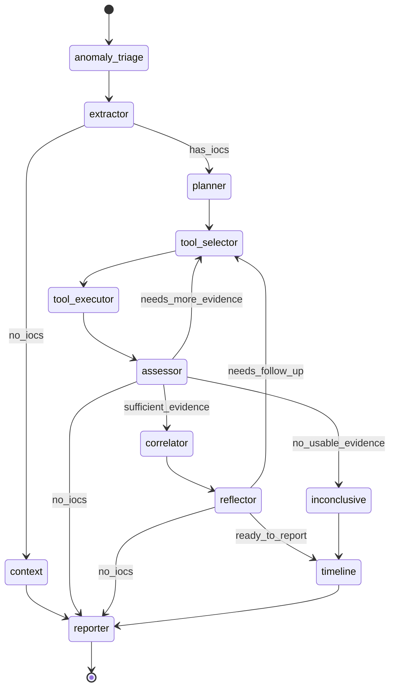

# AI Agent — `DFIRAgent` & State Machine LangGraph

> Dokumen ini adalah referensi utama untuk **Bab II (kajian teori AI Agent)**
> dan **Bab III/IV (rancangan & implementasi AI Agent)**, khususnya untuk
> menjawab dua poin evaluasi:
> 1. **III.3.2a** — diagram state machine LangGraph yang mencakup *seluruh*
>    node dan *conditional edge* (diagram Gambar 4.9-4.10 yang ada dianggap
>    belum lengkap).
> 2. **III.3.2b / 5.2b / 5.2c** — definisi tegas **"agentic tools"** (fungsi
>    internal agent) vs **"external API tools"** (layanan threat-intel
>    eksternal), karena keduanya selama ini disebut "tools" tanpa pembedaan,
>    yang berdampak pada interpretasi metrik *Tool Correctness*.
> 3. **III.3.3.3** — sub-bab yang berjudul "Deteksi Anomali Log Menggunakan
>    DeepLog" tetapi isinya menjelaskan implementasi AI Agent berbasis
>    LangGraph. Dokumen ini memberi konten yang seharusnya ada di sub-bab
>    yang **diganti namanya** menjadi *"Implementasi AI Agent Berbasis
>    LangGraph"*.

---

## 1. Kelas `DFIRAgent` — Gambaran Umum

`DFIRAgent` (`backend/modules/agent.py:28-158`) adalah implementasi agen AI
berbasis pola **ReAct (Reasoning → Action → Observation)** yang dibangun di
atas **LangGraph `StateGraph`**. Kelas ini sebagian besar adalah *thin
delegator*: setiap node memanggil fungsi di modul
`backend/modules/agent_modules/*` (constants, evidence, execution, ioc,
prompts, recommendations, reporting, routing, selection, state, timeline,
tooling) — pola ini memisahkan *control flow* (di `agent.py`) dari *business
logic* (di submodul), yang baik untuk argumen *maintainability* di Bab III.

### 1.1 Konfigurasi LLM default

```python
self.llm = Ollama(
    base_url=ollama_base_url,
    model=ollama_model,            # default: "foundation-sec-8b"
    temperature=0.1,
    top_p=0.7,
    top_k=20,
    num_ctx=16384,
    num_predict=8192,
    repeat_penalty=1.15,
)
```
(`agent.py:73-82`)

Catatan: dalam jalur produksi (`orchestrator_service.py`), LLM ini
sebenarnya diganti dengan klien yang dibangun oleh `build_role_client(...,
role="agent")` — sehingga parameter di atas adalah **default constructor**,
bukan konfigurasi runtime final yang selalu dipakai. Lihat
[02-backend-orkestrasi-api.md §4.1](02-backend-orkestrasi-api.md).

### 1.2 Komponen yang diinisialisasi di `__init__`

| Komponen | Kelas | Peran |
|---|---|---|
| `self.threat_intel` | `ThreatIntelToolkit` (`modules/threat_intel.py`) | Wrapper untuk 6 API threat-intel eksternal (lihat §3). |
| `self.procedural_memory` | `ProceduralMemory` (`modules/procedural_memory.py`), opsional | Memori prosedural lintas-sesi — belajar tool mana yang historis berhasil untuk tipe IOC tertentu. |
| `self.graph` / `self.app` | `StateGraph` terkompilasi | State machine LangGraph (lihat §2). |

---

## 2. State Machine LangGraph — Diagram Lengkap

### 2.1 Definisi graph (`_build_graph`, `agent.py:105-158`)

12 node (termasuk `anomaly_triage` yang ditambahkan Juni 2026), 1 entry
point, 3 *conditional edge router* dengan total 9 cabang bernama. Berikut
diagram **lengkap** (Mermaid) yang mencakup semua node dan semua cabang
kondisional — gunakan ini untuk menggantikan/menambah Gambar 4.9-4.10 di
skripsi:



### 2.2 Tabel node — fungsi, peran, dan modul pendukung

| # | Node (nama di graph) | Method `DFIRAgent` | Delegasi ke | Fungsi |
|---|---|---|---|---|
| 1 | `anomaly_triage` | `triage_anomalies` | `agent_triage.triage_anomalies` | **Entry point baru (Juni 2026).** Satu LLM call membaca isi log aktual tiap window anomali dan memberi label `suspicious`/`uncertain`/`noise`. Window berlabel `noise` di-drop sebelum ekstraksi IOC. |
| 2 | `extractor` | `extract_iocs` | `agent_ioc.extract_iocs_from_anomalies` | Ekstrak IOC unik (IP, domain, URL, MD5, SHA256) dari parameter window anomali + parsed logs. |
| 2 | `context` | `context_case_builder` | `agent_reporting.context_only_summary` | Menyiapkan kasus tanpa IOC valid sebagai state `inconclusive`, lalu tetap meneruskan ke `reporter`. |
| 3 | `planner` | `plan_goals` | `agent_selection.plan_goals` | **Fase perencanaan investigasi**: menyusun prioritas IOC dan rencana enrichment awal berbasis procedural memory atau static playbook. |
| 4 | `tool_selector` | `select_tools` | `agent_selection.select_tools` | Pilih external API tools per IOC. Urutan prioritas: reflection follow-up → follow-up round → planner output → procedural memory → LLM prompt → fallback statis. |
| 5 | `tool_executor` | `execute_tools` | `agent_execution.*` | Eksekusi tool call ke `ThreatIntelToolkit` (request HTTP nyata ke API eksternal) dan membangun evidence state dari hasil provider. |
| 6 | `assessor` | `assess_evidence` | `agent_assessment.assess_evidence` | Menilai apakah evidence hasil enrichment cukup, perlu enrichment tambahan, atau tidak menghasilkan evidence yang usable. |
| 7 | `correlator` | `correlate_findings` | `agent_prompts` + `agent_correlation` | Mengkorelasikan `tool_results` dengan `anomalies`, lalu menghasilkan `correlation_analysis` dan `structured_correlation` (verdict, confidence, findings, evidence gaps, follow-up requests). |
| 8 | `reflector` | `post_correlation_assessment` | `agent_routing` + `_correlation_requires_follow_up` | **Reflection pass ReAct**: membaca hasil korelasi terstruktur dan opsional memicu 1 putaran follow-up tool call tambahan. |
| 9 | `inconclusive` | `inconclusive_correlation` | `agent_reporting.inconclusive_correlation` | Jalur aman ketika enrichment **tidak menghasilkan evidence usable** (semua tool gagal/`skipped`/tidak ada supporting evidence). |
| 10 | `timeline` | `build_timeline` | `agent_timeline.build_attack_timeline` | Susun timeline serangan dari `anomalies` (+ evidence jika ada). |
| 11 | `reporter` | `generate_summary` | `agent_reporting.generate_summary` | LLM menyusun `investigation_summary` & `recommendations` final → diteruskan ke `ReportGenerator` (lihat [02-backend-orkestrasi-api.md](02-backend-orkestrasi-api.md)). |

### 2.3 Tabel conditional edge — router, kondisi, tujuan

Ketiga router didefinisikan di
`backend/modules/agent_modules/routing.py` dan dipanggil dari `agent.py` lewat
wrapper `_route_after_ioc_extraction`, `_route_after_assessment`, dan
`_decide_post_correlation_step`.

| Router | Sumber node | Cabang (`return` value) | Kondisi pemicu | Tujuan |
|---|---|---|---|---|
| `route_after_ioc_extraction` (`routing.py:11-17`) | `extractor` | `has_iocs` | `state["iocs_extracted"]` tidak kosong | `planner` |
| | | `no_iocs` | `iocs_extracted` kosong | `context` |
| `route_after_assessment` (`assessment.py`) | `assessor` | `no_iocs` | tidak ada IOC sama sekali | `reporter` |
| | | `sufficient_evidence` | `tool_execution_round >= max_tool_execution_rounds` (default 2), **atau** tidak ada follow-up tool tersisa | `correlator` |
| | | `no_usable_evidence` | round > 0 **dan** tidak ada `normalized_evidence` yang sukses & bukan `skipped` | `inconclusive` |
| | | `needs_more_evidence` | masih ada tool enrichment yang belum dipanggil (`select_follow_up_tool_calls`) | `tool_selector` |
| `decide_post_correlation_step` (`routing.py:64-96`) | `reflector` | `no_iocs` | tidak ada IOC | `reporter` |
| | | `ready_to_report` | `reflection_round > max_reflection_rounds` (default 1), **atau** tidak ada follow-up tool baru dari refleksi | `timeline` |
| | | `needs_follow_up` | refleksi menemukan IOC mencurigakan/`evidence gap` dan ada follow-up tool baru | `tool_selector` |

### 2.4 Mekanisme *bounded* / fail-open

Tiga konstanta mengontrol agar graph **tidak berjalan tanpa batas**:

| Konstanta | Nilai default | Lokasi | Efek |
|---|---|---|---|
| `DEFAULT_MAX_TOOL_EXECUTION_ROUNDS` | 2 | `agent_modules/constants.py:83` | Maks. 2 putaran `tool_selector → tool_executor → assessor` sebelum dipaksa ke `correlator`. |
| `DEFAULT_MAX_REFLECTION_ROUNDS` | 1 | `agent_modules/constants.py:84` | Maks. 1 putaran tambahan `reflector ⇄ tool_selector` (loop refleksi ReAct). |
| `max_planning_rounds` | 1 (di `build_initial_state`) | `agent_modules/state.py:74` | `planner` hanya berjalan 1 kali; jika lewat, langsung serahkan ke `tool_selector`. |

Semua jalur error (`try/except` di `select_tools`, `correlate_findings`,
`reflector`/`post_correlation_assessment`) **fail-open**: jika LLM gagal/timeout, agent
tetap melanjutkan dengan fallback (tool statis, atau "continue with available
evidence") — tidak pernah membuat graph *stuck*.

---

## 3. Nomenklatur "Tools": Agentic Tools vs External API Tools

Ini adalah klarifikasi konsep yang **harus** ditambahkan ke Bab II (kajian
teori) untuk menjawab kebingungan istilah "tools" pada evaluasi (III.3.2b,
5.2b, 5.2c) dan pada laporan `tool_correctness_eval.md`.

### 3.1 Dua kategori "tools" yang berbeda secara fundamental

| Kategori | Definisi | Contoh konkret di JejakAgent | Siapa yang memanggil | Diuji oleh metrik |
|---|---|---|---|---|
| **Agentic Tools** (disebut juga *internal capability nodes* / "tangan" agent) | Fungsi/komponen internal yang **menjalankan tugas non-LLM** dalam pipeline agent itu sendiri — bukan dipanggil via *function calling* LLM, melainkan merupakan **node LangGraph** atau helper deterministik. | IOC Extractor (`extract_iocs`), Timeline Builder (`build_timeline`), Report Generator (`generate_summary` + `ReportGenerator`), Planner (`plan_goals`) | Dipanggil oleh **graph LangGraph** sebagai bagian dari control flow | Tidak diuji oleh `ToolCorrectnessMetric` — diuji secara tidak langsung lewat G-Eval terhadap output laporan |
| **External API Tools** (disebut juga *threat-intel enrichment tools*) | Fungsi yang melakukan **pemanggilan API pihak ketiga** untuk memperkaya (enrich) sebuah IOC dengan data reputasi/intelijen. Dipilih oleh LLM (atau procedural memory/fallback) berdasarkan tipe IOC. | `threatfox_lookup`, `malwarebazaar_lookup`, `urlhaus_lookup`, `alienvault_otx_lookup`, `greynoise_lookup`, `virustotal_lookup` (`agent_modules/constants.py:21-28`) | Dipilih oleh node `tool_selector`, dieksekusi oleh node `tool_executor` via `ThreatIntelToolkit` | **Inilah yang diuji oleh `tool_correctness_eval.md`** (`DFIRAgent.select_tools()`, mean=0.864) |

### 3.2 Mengapa pembedaan ini penting

Skor **Tool Correctness = 0.864** di
`evaluation/reports/tool_correctness_eval.md` **hanya mengukur kategori
kedua** (external API tools / threat-intel lookup). Skripsi sebaiknya
menyatakan secara eksplisit bahwa:

> "Tool Correctness pada penelitian ini mengevaluasi kemampuan AI Agent dalam
> memilih *external threat-intelligence API tools* yang tepat untuk setiap
> jenis IOC (IP, domain, URL, MD5, SHA256), dan **tidak** mencakup *agentic
> tools* internal seperti IOC Extractor, Timeline Builder, atau Report
> Generator — komponen-komponen tersebut adalah node tetap pada LangGraph yang
> selalu dieksekusi sesuai posisi pada state machine, bukan hasil pemilihan
> dinamis berbasis reasoning LLM."

Ini juga menjelaskan **mengapa** `select_tools()` (bukan node lain) adalah
*subject under test* yang tepat untuk `ToolCorrectnessMetric` — karena hanya
node inilah yang melibatkan *keputusan pemilihan* (selection) di antara
beberapa opsi, sifat yang dibutuhkan metrik tersebut.

### 3.3 6 External API Tools — ringkasan pemetaan IOC → tool

Sumber: `agent_modules/constants.py:21-28` (`TOOL_TO_IOC_TYPES`) dan
`backend/data/api_summary.md`.

| Tool | Tipe IOC didukung | Catatan |
|---|---|---|
| `threatfox_lookup` | ip, domain, url, md5, sha256 | Feed IOC abuse.ch — family malware & threat type |
| `malwarebazaar_lookup` | md5, sha256 | Sample intel, signature, tags |
| `urlhaus_lookup` | url | Status hosting malware URL |
| `alienvault_otx_lookup` | ip, domain, url, md5, sha256 | Pulse komunitas, reputasi, relasi IOC |
| `greynoise_lookup` | ip | Klasifikasi scanner/noise vs malicious |
| `virustotal_lookup` | ip, domain, url, md5, sha256 | Agregasi reputasi multi-engine |

`STATIC_FALLBACK_TOOLS` (`constants.py:66-81`) mendefinisikan urutan
prioritas fallback per tipe IOC jika LLM dan procedural memory tidak
memberikan hasil — contoh untuk `ip`:
`[greynoise_lookup, threatfox_lookup, alienvault_otx_lookup,
virustotal_lookup]`.

### 3.4 Prompt LLM untuk Tool Selection

Prompt lengkap ada di `agent_modules/prompts/tool_selection.py:6-65`. Poin
penting untuk Bab III:

- Persona prompt: *"Security Analyst TNI AL yang ahli dalam Digital Forensics
  & Incident Response"* — ini mengindikasikan domain *role-prompting* yang
  digunakan, relevan untuk diskusi *prompt engineering* di Bab II/III.
- Prompt membatasi daftar IOC ke **15 entri pertama** (`iocs[:15]`) untuk
  menjaga panjang prompt.
- Format output yang diminta adalah baris `tipe:nilai -> nama_tool`, diparsing
  oleh `_parse_tool_selections()`.
- Terdapat *mapping guideline* eksplisit per tipe IOC (mis. IP →
  prioritaskan `greynoise_lookup` + `threatfox_lookup`) — ini adalah bentuk
  *few-shot/instruction grounding* yang membantu LLM kecil (8B) tetap
  konsisten.

---

## 4. `InvestigationState` — Kontrak Data Antar-Node

Didefinisikan sebagai `TypedDict` di `agent_modules/state.py:9-52`, dengan
factory `build_initial_state()` (`state.py:55-98`). State ini adalah **memori
kerja** (working memory) yang mengalir di seluruh graph — setiap node
membaca sebagian field dan mengembalikan `dict` parsial yang di-*merge*
LangGraph ke state global.

| Kelompok | Field | Tipe | Catatan |
|---|---|---|---|
| **Input** | `anomalies` | `List[Dict]` | Anomali dari DeepLog (sudah difilter LLM Gate) |
| | `parsed_logs` | `pd.DataFrame` | Hasil parsing Drain3 |
| **Episodic Memory** | `iocs_extracted` | `List[Dict]` | Output node `extractor` |
| | `tool_calls` / `tool_results` | `Annotated[List, operator.add]` | **Accumulator** — setiap node menambah, tidak menimpa |
| | `reasoning_steps` / `planning_steps` / `reflection_steps` | `Annotated[List[str], operator.add]` | Jejak penalaran ReAct yang terakumulasi (audit trail) |
| | `planned_tool_calls` | `Annotated[List[Dict], operator.add]` | Output `planner` |
| | `planning_completed`, `planning_round`, `max_planning_rounds` | bool/int | Kontrol fase planning |
| | `post_correlation_follow_up_calls` | `Annotated[List[Dict], operator.add]` | Output refleksi pasca-korelasi |
| | `observation_assessment`, `reflection_round`, `max_reflection_rounds` | str/int | Kontrol loop refleksi |
| | `correlation_analysis` | `str` | Output LLM node `correlator` |
| | `normalized_evidence` | `Annotated[List[Dict], operator.add]` | Hasil tool yang sudah dinormalisasi |
| | `aggregated_ioc_evidence` | `Dict[str, Dict]` | Agregasi evidence per-IOC |
| | `tool_selection_trace` / `tool_validation_trace` / `agent_trace` | `Annotated[List[Dict], operator.add]` | Jejak audit pemilihan & validasi tool |
| | `investigation_status`, `investigation_confidence`, `confidence_factors` | str/float/list | Penilaian kepercayaan hasil investigasi |
| | `supporting_evidence` | `List[Dict]` | Evidence pendukung untuk laporan |
| | `inconclusive_reason` | `str` | Diisi jika graph masuk node `inconclusive` |
| **Output** | `investigation_summary` | `str` | Narasi akhir (dari `generate_summary`) |
| | `attack_timeline` | `List[Dict]` | Dari `build_timeline` |
| | `recommendations` | `List[str]` | Dari `generate_summary` |
| **Control** | `current_stage`, `completed` | str/bool | Status terkini graph |
| | `tool_execution_round`, `max_tool_execution_rounds` | int | Kontrol loop tool execution |

Nilai awal semua field ada di `build_initial_state()` — penting untuk
menunjukkan bahwa **setiap akumulator dimulai dari list kosong** dan
**setiap counter dimulai dari 0**, sehingga perilaku *bounded loop* di §2.4
dapat diverifikasi dari kondisi awal yang deterministik.

---

## 5. Procedural Memory — Pembelajaran Strategi Tool Lintas-Sesi

`self.procedural_memory` (opsional, `ProceduralMemory` dari
`modules/procedural_memory.py`) memberi agent **memori jangka panjang**
tentang tool mana yang historis berhasil untuk strategi IOC tertentu
(`IOC_TYPE_TO_MEMORY_STRATEGY`, `constants.py:58-64`: ip→`ip_address`,
md5/sha256→`file_hash`, domain→`domain`, url→`url`).

Alur penggunaannya:
1. `planner` (`agent_selection.plan_goals`) mencoba
   `_select_tools_from_memory(iocs)` **lebih dulu** sebelum fallback ke
   *static IOC playbook* (`STATIC_FALLBACK_TOOLS`).
2. `tool_selector` (`agent_selection.select_tools`) mengulang prioritas yang
   sama jika `planner` tidak menghasilkan rencana.
3. Hasil eksekusi tool (sukses/gagal) **menulis kembali** ke
   `ProceduralMemory` (lihat `data/procedural_memory.json` /
   `backend/data/test_procedural_memory.json`), sehingga strategi tool
   ber-evolusi antar sesi investigasi.

Ini adalah argumen kuat untuk Bab II terkait *adaptivitas* agent —
`ProceduralMemory` membuat pemilihan *external API tools* tidak murni statis
maupun murni LLM-driven, tetapi **bertingkat**: memory → LLM → fallback
statis, dengan memory yang terus diperbarui dari observasi nyata.

---

## 6. Mapping ke Sub-Bab Skripsi

| Sub-bab saat ini | Masalah (dari evaluasi) | Rekomendasi konten dari dokumen ini |
|---|---|---|
| III.3.3.3 "Deteksi Anomali Log Menggunakan DeepLog" | Judul tidak sesuai isi (isi = LangGraph AI Agent) | Ganti judul menjadi **"Implementasi AI Agent Berbasis LangGraph"**; isi diambil dari §1-§2 dokumen ini |
| Gambar 4.9-4.10 (state machine) | Tidak mencakup semua node/edge | Ganti/lengkapi dengan diagram §2.1 (11 node, 9 cabang kondisional) |
| Bab II (kajian teori tools) | "Tools" tidak dibedakan, memengaruhi interpretasi Tool Correctness | Tambahkan sub-bab baru berisi §3 (Agentic Tools vs External API Tools) |
| Bab IV (Tool Correctness 0.864) | Tidak jelas tools apa yang diuji | Tambahkan kalimat klarifikasi dari §3.2 |
